# **Wanderlust Wonders**
**Under Guidance Of**

Mr.Ashraf Ali

Subject Matter Expert(PHP)

Ardent Computech Pvt Ltd(An ISO 9001:2008 Certified)

CF-137, Sector - 1, Salt Lake City, Kolkata - 700 064

A

Project Report

Submitted In Partial Fulfillment Of The Requirements For The Award Of the

Bachelor of Technology

**Project Carried Out At**

**Ardent Computech Pvt Ltd(An ISO 9001:2008 Certified)**

CF-137, Sector - 1, Salt Lake City, Kolkata - 700 064

**Submitted By:**

**Dipto Das**

**Meenakshi Sarkar**

**Shivam Talukdar**

**Swapnil Bhattacharya**

**Bachelor of Computer Application**

`                            `**The Heritage Academy**

`        `Kolkata - 700107

West Bengal | INDIA |

***(Note: All entries of the proforma of approval should be filled up with appropriate and complete information of approval in any respect will be summarily rejected.)***

1. Name of the Student With Group:	1: Dipto Das

2: Meenakshi Sarkar

3: Shivam Talukdar

4: Swapnil Bhattacharya

1. Title of the Project	:	**TOURS AND TRAVELS WEBSITE**
1. Name and Address of the Guide	:	**Mr. Ashraf Ali**

Sr. Subject Matter Expert & Technical Head(PHP) Ardent Computech Pvt Ltd(An ISO 9001:2008 Certified) CF-137, Sector - 1, Salt Lake City, Kolkata - 700 064

1. Educational Qualification of the Guide :	Ph.d\*	M.tech\*	B.E\*/B.Tech \*	MCA\* M.Sc\*

1. Working and Teaching experience

of the Guide **:	…….Years**

1. Software used in the Project:
   1. **Visual Studio Code**
   1. **MongoDB**
   1. **NodeJs**
   1. **ExpressJs**
   1. **ReactJs**
   1. **Bouml**

1\.

2\.

3\.

4\.

Signature of the Student	Signature of the

Guide Date:	Date:

**For Office Use Only	Name: Mr. Ashraf Ali**

.	**Subject Matter Expert.**

Signature, Designation, Stamp of

**Not Approved**

**Approved**

the Project Proposal Evaluator

###### **Project Responsibility Form**

|**SERIAL NUMBER**|**NAME OF MEMBER**|**RESPONSIBILITY**|
| :- | :- | :- |
|1|Dipto Das|Project Leader, Home Page and Admin Panel and Backend.|
|2|Meenakshi Sarkar|Full Description of all the holiday packages and Booking and Payment Form.|
|3|Shivam Talukdar|Contact us and About us page.|
|4|Swapnil Bhattacharya|Holiday packages card, Contact Us, About Us and Backend.|

**Self Certificate**

This is to certify that the dissertation/project proposal entitled    

**“TOURS & TRAVEL WEBSITE”**
####### ` `**is done by us, is an Authentic work carried out for the** 
####### **partial fullfillment of the requirements for the award of the** 
####### **certificate of** Bachelor of Technology **under the guidance** 
####### **of** Mr.Ashraf Ali**. The matter embodied in this project work has** 
####### **not been submitted earlier for award of any certificate to** 
####### **the best of our knowledge and belief.**

Name of the

Student



- Dipto Das
- Meenakshi Sarkar
- Shivam Talukdar
- Swapnil Bhattacharya

Signature of the students

a.

b.

c.

d.

###### **Certificate by Guide**

This is to certify that this project entitled **“Tours & Travels Website** “submitted in partial fulfillment of the certificate of Bachelor of Computer Science through **Ardent Computech Pvt Ltd**, done by the Group Members

- **Dipto Das**
- **Meenakshi Sarkar**
- **Shivam Talukdar**
- **Swapnil Bhattacharya**

is an authentic work carried out under my guidance & best of our knowledge and belief...

a.

b.

c.

d.

Signature of the students

Date:



Signature of the Guide Date:

**Certificate of Approval**

This is   to   certify   that   this   proposal   of   Minor   project,   entitled

**“Tours and Travels Website ”**

is a record of bona-fide work, carried out by: 1.Dipto Das, 2.Meenakshi Sarkar,  3.Shivam Talukdar, 4.Swapnil Bhattacharya under my supervision and guidance through the	Ardent Computech Pvt Ltd. In my opinion, the report in its present form is in partial fulfillment of all the requirements, as specified by the Future Institute Of Technology as per regulations of the ***Ardent®*** . In fact, it has attained the standard, necessary for submission. To the best of my knowledge, the results embodied in this report, are original in nature and worthy of incorporation in the present version of the report for Bachelor of Technology.

Guide/Supervisor

####### **Mr. Ashraf Ali**
Subject Matter Expert & Technical Head (Php) Ardent Computech Pvt Ltd (An ISO 9001:2008 Certified) CF-137, Sector - 1, Salt Lake City, Kolkata - 700 064

**External Examiner(s)**



**Head of the**

**Department**

Department of Computer Science

**TOURS & TRAVELS  WEBSITE**

**TABLE OF CONTENTS**

|**S.NO**|**Name of the topic**|**Page No.**|
| :- | :- | :- |
|1|Company Profile|10|

2. [**Introduction**	11-13](#_toc_250007)
   1. [Objective	12](#_toc_250006)
   1. [Scope	13](#_toc_250005)
2. **System Analysis**	15-25
   1. [Identification of Need	15](#_toc_250004)
   1. [Feasibility Study	16](#_toc_250003)
   1. [Work flow	17](#_toc_250002)
   1. [Study of the System	21](#_toc_250001)
   1. Input & Output	22
   1. Software Requirements Specification(SRS)	23
   1. [Software Engineering Paradigm Applied	24](#_toc_250000)

|4\.	**System Design**|27-41|
| :- | -: |
|4\.a	Data Flow Diagram(DFD)|26-31|
|4\.b	Sequence Diagram|32-34|
|||
|4\.d	Use-case Diagram|35-39|

5. Modularization Details	40-41
5. Database Design	41-42

####### 5\.	**Output Screen	44-49**
5\.a	User Interface Design	44-49

|**6 Implementation & Testing**||**50**|
| :- | :- | -: |
|6\.a Introduction||50|
|6\.b Objectives of Testing||51|
|6\.c Test Cases||52|
|6\.d White Box Testing||57|
|6\.e Black Box Testing||57|
|6\.f Output Testing||58|
|6\.g Goal of Testing||59|
|6\.h Integration Test Reports||59|
|**7.System Security Measures**|**6**||
|7\.a Database security|61-62||
|7\.b System Security|62||
|7\.cLimitations|63||
|**8. CONCLUSION**|**63**||
9. ####### **Future Scope & Further Enhancement	63-64**
9. **BIBLIOGRAPHY	63**

<table><tr><th colspan="1" rowspan="6" valign="top">

</th><th colspan="1" valign="top">

<b>1. ARDENT COMPUTECH PVT.LTD.</b>

Ardent Computech Private Limited is an ISO 9001-2008 certified Software Development Company in India. It has been operating independently since 2003. It was recently merged with ARDENT TECHNOLOGIES.

Ardent Technologies
</th><th colspan="1" valign="top"></th></tr>
<tr><td colspan="1" valign="top">ARDENT TECHNOLOGIES is a Company successfully providing its services currently in UK, USA, Canada and India. The core line of activity at ARDENT TECHNOLOGIES is to develop customized application software covering the entire responsibility of performing the initial system study, design, development, implementation and training. It also deals with consultancy services and Electronic Security systems. Its primary clientele includes educational institutes, entertainment industries, resorts, theme parks, service industry, telecom operators, media and other business houses working in various capacities.</td><td colspan="1" rowspan="2" valign="top"></td></tr>
<tr><td colspan="1" valign="top">Ardent Collaborations</td></tr>
<tr><td colspan="1" valign="top">
ARDENT COLLABORATIONS, the Research Training and Development Department of ARDENT COMPUTECH PVT LTD is a professional training Company offering IT enabled services & industrial trainings for B-Tech, MCA,

BCA, MSc and MBA fresher’s and experienced developers/programmers in various platforms. Summer Training / Winter Training / Industrial training will be provided for the students of B.TECH, M.TECH, MBA and MCA only. Deserving candidates may be awarded stipends, scholarships and other benefits, depending on their performance and recommendations of the mentors.
</td><td colspan="1" rowspan="2" valign="top"></td></tr>
<tr><td colspan="1" valign="top">Associations</td></tr>
<tr><td colspan="1" valign="top"></td><td colspan="1" valign="top"></td></tr>
</table>

Ardent is an ISO 9001:2008 company.

It is affiliated to National Council of Vocational Training (NCVT), Directorate General of Employment & Training (DGET), Ministry of Labor & Employment, and Government of India.

# **2. INTRODUCTION**
Tourism and travel have undergone tremendous growth and diversification to 
become a major force in the international economy. Many developing countries 
have increased their presence in the market, particularly as travelers have 
expanded beyond the more traditional destinations in order to seek out new 
places and experiences. The intent of this guide is to provide resources for those 
interested in researching current tourism and travel industry trends, though 
a few historical resources have been included for perspective. We have also tried 
to include resources that provide data and information that will help researchers 
develop their own market profile. We have also covered a few specific areas that 
are frequently discussed; however, this guide does not attempt to go into all sectors 
of the tourism and travel industry. We have not included resources related to some 
emerging trends such as disaster/dark tourism (i.e. going to places affected by a 
disaster like New Orleans post-Katrina or Chornobyl) and over-tourism because 
these emerging areas are in flux and may not have many resources devoted 
specifically to them. We have included a few resources related to the airline industry 
and other transportation modes that are used to travel and whose business is closely 
tied to tourism, but this guide does not focus on transportation. Lastly, this guide 
does not focus on larger world events that heavily impact the industry like recessions 
or a large-scale health crisis like COVID-19; but news and trade publications should 
be a good source for information on how those particular events affect the industry.

# **2a. OBJECTIVE**
###### **Convenience**
###### There are various conveniences of using a website for a tour and travel. Low-cost method of selling accommodation services. Reduced online marketing spend as OTAs invest in advertising to attract potential customers. Impartial reviews give customers the confidence to book. Users can easily compare various accommodation costs in one place.

####### **Instant Consultancy**
You can easily book a tour for yourself as per your convenience and at a very low cost. It will save you the time needed to go to a tour and travel company’s office and book your trip. It gives an even more clear vision of how your trip is going to be.

####### **Overcome the limitations of a physical visit to a doctor**
A physical office has a lot of limitations starting with the location limit. A physical office is in a fixed location and can only compete with the offices  nearby and have customers in the local region but a website can be internationally accessed as well.
####### **Increase sales**
When you have a wider reach your sales will also increase and add

the convenience of getting an idea of the entire package easily.

**2b. SCOPE**

Tourism  is  the  world’s  largest  industry  that  generates  employment  and  provides  a 

source  of  foreign  exchange  to  the  country.  This  lesson  deals  with  the  approaches  to 

define tourism as an industry  and the problems faced  by  this industry.  The scope of 

the tourism is very important to understand. This provides a great understanding of the 

duties and responsibilities of the travel agent. How they carry out their work and their 

function as per the need and the demand of the client. The tour operator and the travel 

agents  play  an  important  role  in  making  the trip  of  the  tourist  a  good  experience.  In 

this lesson we will study all the aspects and the requirements of the tourist in order to 

make  the  tour  of  the  client a  remarkable  and  memorable  and  how  the tour  operator 

work and give a good impression on the customer to increase their business

Tourism  is  the  world’s  largest  industry  that  generates  employment  

and  provides  a source  of  foreign  exchange  to  the  country.  This  

lesson  deals  with  the  approaches  to define tourism as an industry 

` `and the problems faced  by  this industry.  The scope of the tourism 

is very important to understand. This provides a great understanding

` `of the duties and responsibilities of the travel agent. How they carry

` `out their work and their function as per the need and the demand of 

the client. The tour operator and the travel agents  play  an  important  

role  in  making  the trip  of  the  tourist  a  good  experience.  In this 

lesson we will study all the aspects and the requirements of the tourist 

in order to make  the  tour  of  the  client a  remarkable  and  memorable 

` `and  how  the tour  operator work and give a good impression on the 

customer to increase their business.

Tourism  is  the  world’s  largest  industry  that  generates  employment  and  provides  a 

source  of  foreign  exchange  to  the  country.  This  lesson  deals  with  the  approaches  to 

define tourism as an industry  and the problems faced  by  this industry.  The scope of 

the tourism is very important to understand. This provides a great understanding of the 

duties and responsibilities of the travel agent. How they carry out their work and their 

function as per the need and the demand of the client. The tour operator and the travel 

agents  play  an  important  role  in  making  the trip  of  the  tourist  a  good  experience.  In 

this lesson we will study all the aspects and the requirements of the tourist in order to 

make  the  tour  of  the  client a  remarkable  and  memorable  and  how  the tour  operator 

work and give a good impression on the customer to increase their business

**SYSTEM ANALYSIS**

## **3a. IDENTIFICATION OF NEED**
Tourism gives a big boost to the economy in terms of consumer spending, job creation and more. For developing and emerging countries tourism can provide a great push to the economy.

Tourism brings people from everywhere in the world. It is connecting places with people; places with places; and people with people. This sector brings the developed, growing, developing and emerging economies, all on single platform, thus driving them to become competitive globally and improve on their level of services, at least to be tourism     competitive. It can even drive countries to have a stable and sound political environment      and also have a more developed society.

Here are **5 key importance and advantages of tourism industry**. These are also the advantages of tourism and are actually its 5 basic characteristics which signifies the tourism importance for economies, for countries & their societies, and also at the global scale.         Due to these 5 factors only tourism creates demand, fulfills that demand, increases consumption, and brings growth and development to countries and economies.

Tourism activity creates demand

Tourism industry value chain meets & spreads demand across industries & boosts more economic activities

Tourism requires country's wholesome development

Motivates to reach Global Standards

Tourism induces more consumption
##
##
##
##
##
## **3b. FEASIBILITY STUDY**

Feasibility study is made to see if the project on completion will serve the purpose the organization for the amount of work.

Effort and the time that spend on it. Feasibility study lets the

developer foresee the future of the project and the usefulness. A Feasibility study of a system proposal is according to its workability, which is the impact on the organization, ability to meet their user

needs and effective use of resources. Thus, when a new application is proposed it normally goes through a feasibility study before it is

approved for development.

The document provides the feasibility of the project that is being designed and lists various area that were considered very carefully during the feasibility study of this project such as Technical, Economic and operational feasibilities.

At the backdrop of such a conducive business atmosphere Feasibility Study                Reports on Hotel / Resort Development attempts to examine such critical  

`   `factors which will provide vital inputs in general to the potential investors 

`   `and estimation of commercial viability of such an investment. It presents 

`   `the market analysis of the hospitality industry in terms of structure

`   `segmentation, market size, major share etc.

## **3c. WORK FLOW**
The proposed work focuses on implementation an Tours and Travels Website. The basic function of this website is to help customers book there holidays easily and also allow the travel agents to keep a track of these bookings. The Waterfall Model has been used here for implementation.

The system is implemented by react js and node js for the frontend, which created a dynamic UI which is easy to understand.

Waterfall model is the earliest SDLC approach that was used for software development.

The Waterfall Model illustrates the software development process in a linear sequence flow; hence it is also referred to as a linear-sequential life cycle model. This means that any phase in the development process begins only if the previous phase is complete. In Waterfall model phases do not overlap.

####### **Waterfall Model design**
Waterfall approach was first SDLC Model to be used widely in Software Engineering to ensure success of the project. In "The Waterfall" approach, the whole process of software development is divided into separate phases. In Waterfall model, typically, the outcome of one phase acts as the input for the next phase sequentially.

Following is a diagrammatic representation of different phases of waterfall model.

The sequential phases in Waterfall model are:

- **Requirement Gathering and analysis:** All possible requirements of the system to be developed are captured in this phase and documented in a requirement specification doc.

- **System Design:** The requirement specifications from first phase are studied in this phase and system design is prepared. System Design helps in specifying hardware and system requirements and also helps in defining overall system architecture.

- **Implementation:** With inputs from system design, the system is first developed in small programs called units, which are integrated in the next phase. Each unit is developed and tested for its functionality which is referred to as Unit Testing.

- **Integration and Testing:** All the units developed in the implementation phase are integrated into a system after testing of each unit. Post integration the entire system is tested for any faults and failures.

- **Deployment of system:** Once the functional and non- functional testing is done, the product is deployed in the customer environment or released into the market.

- **Maintenance:** There are some issues which come up in the client environment. To fix those issues patches are released. Also, to enhance the product some better versions are released. Maintenance is done to deliver these changes in the customer environment.

All these phases are cascaded to each other in which progress is seen as flowing steadily downwards (like a waterfall) through the phases. The next phase is started only after the defined set of goals are achieved for previous phase and it is signed off, so the name "Waterfall Model". In this model phases do not overlap.

Waterfall Model Application

Every software developed is different and requires a suitable SDLC approach to be followed based on the internal and external factors. Some situations where the use of Waterfall model is most appropriate are:

- Requirements are very well documented, clear and fixed.
- Product definition is stable.
- Technology is understood and is not dynamic.
- There are no ambiguous requirements.
- Ample resources with required expertise are available to support the product.
- The project is short.

The advantage of waterfall development is that it allows for departmentalization and control. A schedule can be set with deadlines for each stage of development and a product can proceed through the development process model phases one by one.

Development moves from concept, through design, implementation, testing, installation, troubleshooting, and ends up at operation and maintenance. Each phase of development proceeds in strict order

## **3d. STUDY OF THE SYSTEM**
Modules:

The modules used in this software are as follows:

- LOGIN: This module is for USER. There are two sections-login and signup. At first, user can signup  and then login using the same login credentials.
- HOME: This page contains an overview of highlights for other pages. This page has 3 sections- i) Header, ii) Body,

iii) Footer. Header part contains a navigation bar and footer part contains interaction. Body part contains some featured products.

- ABOUT-US: This page contains the information about the developer team.

- CONTACT: This page contains the information about the leader of the development team where a user can easily contact with us.

- PACKAGES: This page contains the information of all the package details and user can easily find a package by using their key value.

- ADMIN PANEL: In this section, the admin will login. The admin can briefly view the  total number of new bookings, and also the  total cancelled bookings.

## **3e. INPUT AND OUTPUT**
The main inputs, outputs and the major function the details are:

INPUT

- User can sign-in using email and password.
- Admin can login using email and password.
- User can login using the same email and password which they are used in sign-in.
- Admin can login using the same email and password which they are used in sign-in.
- User can visit our website and to view holiday packages and book there trips.
- Admin can change or modify the package details.

OUTPUT

- User can see their booked packages.
- Admin can view the details of the package, payment and user.
- User can also interact with Admin.

## **3f. SOFTWARE REQUIREMENT SPECIFICATIONS**
**AIM**: Suppose your organization is planning to develop a travel application. Design a software requirement system for the given project.

Introduction

1\.1. Purpose: The purpose of this document is to describe 

the external requirements for an automated book-keeping

system that keep track of various operations of a travel 

agency. It also describes the interfaces for the system.

1\.2. Scope : This document describes the requirements of 

the above-mentioned system. It is meant to be used by 

the developers and will be the basis for validating the final

delivered system. Any changes made to the requirements 

in the future will be made with the permission of the 

client. The developer is responsible for asking for 

clarifications, where necessary

Introduction

1\.1. Purpose: The purpose of this document is to describe 

the external requirements for an automated book-keeping

system that keep track of various operations of a travel 

agency. It also describes the interfaces for the system.

1\.2. Scope : This document describes the requirements of 

the above-mentioned system. It is meant to be used by 

the developers and will be the basis for validating the final

delivered system. Any changes made to the requirements 

in the future will be made with the permission of the 

client. The developer is responsible for asking for 

clarifications, where necessary

**PURPOSE**: The purpose of this document is to describe the external requirements for an automated book-keepingsystem that keep track of       various operations of a travel agency. It also describes the interfaces for the system.

**SCOPE**: This document describes the requirements of the above-mentioned system. It is meant to be used by the developers and will be the basis for validating the finaldelivered system. Any changes made to the requirements     in the future will be made with the permission of the client. The developer is responsible for asking for clarifications, where necessary.

**Functional Requirements**

**Register Customers**

**Collect Detail about CustomerInput:** 

- Customer name, customer address, phone number.Output: 
- Updating entered data in customer database as temporary.

`    `**Description:**

- Only for valid information Request is generated.
- ` `New set of information given must not match completely with an existing entry in customer database.
- Previously entered customer data stored temporarily in customer 

database.

Output:

· User name and password for the corresponding 

customer. 

· Converting of temporary customer data to 

permanent.

Description:

· The employees of the organization permanently 

store the relevant data on confirmation of 

receiving deposit money.

` `**Output:**

- User name and password for the corresponding customer. 
- Converting of temporary customer data to permanent.

`  `**Description:**

- Process Online Request

**External interface Requirements**

` `**User Interfaces**

**This software needs the following user interfaces:**

- **Registration Window:**
  - **User: The customerProperties:**
    - This window is used for entry of customer details and 

registering a new customer for the online booking system. 

- ` `This window has various text fields to take the information 

name, address, phone number. 

**Log in Window:**

**User:** 

The customer, the employees of the organisation using the software, the managerProperties:

- This window has two fields for email and password, two buttons to

` `log in and register.

- For correct email and password it opens an appropriate window.
- It has register button to let new customer register by redirecting to registration window.

**Customer Homepage:**

**User:** Registered customer

**Admin Homepage :**

**User:** The admin of the organisation using the software.

**Other Non-functional Requirements:**

- Performance: In every case the response time will be less than 1 second except  for the cases where internet connection is used.
- Security: This software offers password protection so that only regular      customers can book cars, only authorized personnel can editdata corresponding to booking, billing and car information

**HARDWARE REQUIREMENTS:**

- Computer that has a 1.6GHz or faster processor

- 1 GB (32 Bit) or 2 GB (64 Bit) RAM (Add 512 MB if running in a virtual machine)
- HDD 20 GB Hard Disk Space and Above Hardware Requirements.

##### **SOFTWARE REQUIREMENTS:**
- Visual Studio Code
- React Js
- Node Js
- ExpressJs
- MongoDB
- Bouml

## **3g. SOFTWARE ENGINEERING PARADIGM APPLIED**
Software paradigm is a theoretical framework that serves as a guide for the development and structure of a software system. Software paradigms refer to the methods and steps, which are taken while designing the software. There are many methods proposed and are in work today, but we need to see where in the software engineering these paradigms stand. These can be combined into various categories, though each of them is contained in one another.

Programming paradigm is a subset of Software design paradigm which is further a subset of Software development paradigm.

There are two levels of reliability. The first is meeting the right

requirement. A carefully and through systems study is needed to satisfy this aspect of reliability. The second level of systems reliability involves the actual working delivered to the user. At this level, the systems reliability is interwoven with software engineering and

development. There are three approaches to reliability.

1) Error avoidance: Prevents errors from occurring in software.

1) Error detection and correction: In this approach errors are recognized whenever they are encountered and correcting the error by effect of error of the system does not fail.

1) Error tolerance: In this approach errors are recognized whenever they occur, but enables the system to keep running through degraded perform or Appling values that instruct the system to continue process.

**Maintenance:**

The key to reducing need for maintenance, while working, if possible, to do essential tasks.

1. More accurately defining user requirement during system development.
1. Assembling better systems documents.
1. Using some effective methods for designing, processing, and login and communicating information with project team members.
1. Making better use of existing tools and techniques.

**SYSTEM DESIGN**

# **4a. DATA FLOW DIAGRAM**
A **data flow diagram** (**DFD**) is a graphical representation of the "flow" of data through an information system, modelling its process aspects. A **DFD** is often used as a preliminary step to create an overview of the system, which can later be elaborated.

DFDs can also be used for the visualization of data processing (structured design).

A DFD shows what kind of information will be input to and output from the system, where the data will come from and go to, and where the data will be stored. It does not show information about the timing of process or information about whether processes will operate in sequence or in parallel (which is shown on a [flowchart](https://en.wikipedia.org/wiki/Flowchart)[)](https://en.wikipedia.org/wiki/Flowchart).

This context-level DFD is next "exploded", to produce a Level 1 DFD that shows some of the detail of the system being modelled. The Level 1 DFD shows how the system is divided into sub-systems (processes), each of whi1ch deals with one or more of the data flows to or from an external agent, and which together provide all of the functionality of the system as a whole. It also identifies internal data stores that must be present in order for the system to do its job, and shows the flow of data between the various parts of the system.

Data flow diagrams are one of the three essential perspectives of the structured-systems analysis and design method [SSADM](https://en.wikipedia.org/wiki/SSADM)[. ](https://en.wikipedia.org/wiki/SSADM)The sponsor of a project and the end users will need to be briefed and consulted throughout all stages of a system's evolution. With a data flow diagram, users are able to visualize how the system will operate, what the system will accomplish, and how the system will be implemented. The old system's dataflow diagrams can be drawn up and compared with the new system's data flow diagrams to draw comparisons to implement a more efficient system. Data flow diagrams can be used to provide the end user with a physical

idea of where the data they input ultimately has an effect upon

the structure of the whole system from order to dispatch to report.

How any system is developed can be determined through a data flow diagram model.

In the course of developing a set of *leveled* data flow diagrams the analyst/designer is forced to address how the system may be decomposed into component sub-systems, and to identify the [transaction ](https://en.wikipedia.org/wiki/Transaction_data)[data ](https://en.wikipedia.org/wiki/Transaction_data)in the [data model](https://en.wikipedia.org/wiki/Data_model)[.](https://en.wikipedia.org/wiki/Data_model)

Data flow diagrams can be used in both Analysis and Design phase of the [SDLC](https://en.wikipedia.org/wiki/Systems_development_life-cycle)[.](https://en.wikipedia.org/wiki/Systems_development_life-cycle)

There are different notations to draw data flow diagrams. defining different visual representations for processes, data stores, data flow, and external entities.[\[6](https://en.wikipedia.org/wiki/Data_flow_diagram#cite_note-6)[\]](https://en.wikipedia.org/wiki/Data_flow_diagram#cite_note-6)

**DFD NOTATION**

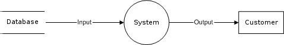DFD EXAMPLE

Steps to Construct Data Flow Diagram:-

Four Steps are generally used to construct a DFD.

- Process should be named and referred for easy

reference. Each name should be representative of the reference.

- The destination of flow is from top to bottom and from left to right.
- When a process is distributed into lower level details they are numbered.
- The names of data stores, sources and destinations are written in capital letters.

Rules for constructing a Data Flow Diagram:-

- Arrows should not cross each other.
- Squares, Circles, Files must bear a name.
- Decomposed data flow squares and circles can have same names.    Draw all data flow around the outside of the diagram.

##
##
## **DATA FLOW DIAGRAM**
LEVEL-0 DFD DIAGRAM

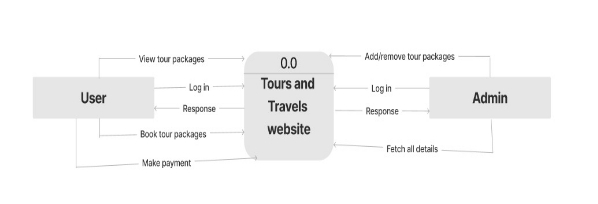

**LEVEL-1 DFD DIAGRAM (ADMIN SIDE)**

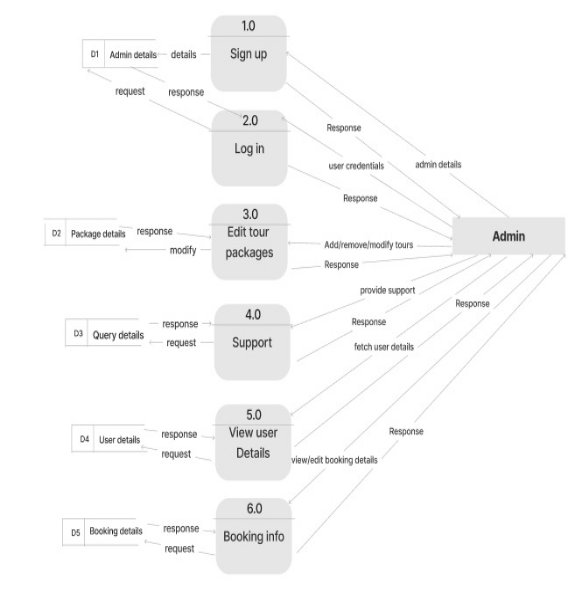

**LEVEL-1 DFD DIAGRAM (USER SIDE)**

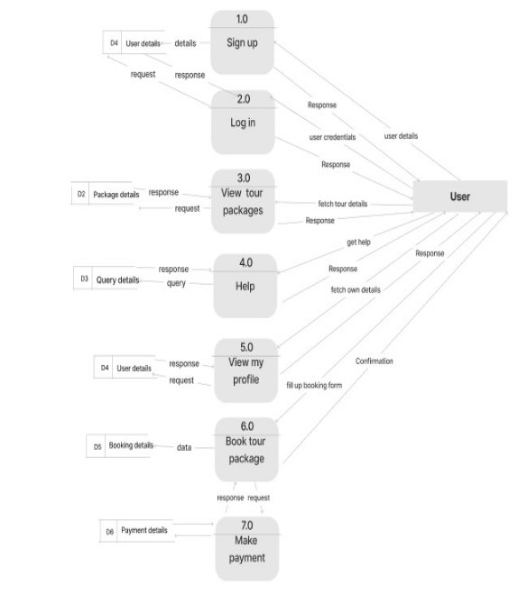

#
#
#
#
# **4b.SEQUENCE DIAGRAM**

A **Sequence diagram** is an interaction diagra[m ](http://en.wikipedia.org/wiki/Interaction_diagram)that shows how processes operate with one another and what is their order. It is a construct of a [Message Sequence Chart](http://en.wikipedia.org/wiki/Message_Sequence_Chart)[.](http://en.wikipedia.org/wiki/Message_Sequence_Chart) A sequence diagram shows object interactions arranged in time sequence. It depicts the objects and classes involved in the scenario and the sequence of messages exchanged between the objects needed to carry out the functionality of the scenario. Sequence diagrams are typically associated with use case realizations in the Logical View of the system under development. Sequence diagrams are sometimes called **event diagrams** or **event scenarios**.

A sequence diagram shows, as parallel vertical lines (*lifelines*),    different    processes    or    objects    that    live

simultaneously, and, as horizontal arrows, the messages exchanged between them, in the order in which they occur.

`		      `This allows the specification of simple runtime scenarios in a graphical **Sequence diagram** is the most common kind of [**interaction diagram**](http://www.uml-diagrams.org/uml-25-diagrams.html#interaction-diagram)[,](http://www.uml-diagrams.org/uml-25-diagrams.html#interaction-diagram) which focuses on the [**message](http://www.uml-diagrams.org/sequence-diagrams.html#message)** interchange between a number of [**lifelines**](http://www.uml-diagrams.org/sequence-diagrams.html#lifeline)[.](http://www.uml-diagrams.org/sequence-diagrams.html#lifeline)

Sequence diagram describes an interaction by focusing on the sequence of messages that are exchanged, along with their corresponding occurrence specifications on the lifelines.

The following nodes and edges are typically drawn in a **UML sequence diagram**: [**lifeline**](http://www.uml-diagrams.org/sequence-diagrams.html#lifeline)[, ](http://www.uml-diagrams.org/sequence-diagrams.html#lifeline)[**execution](http://www.uml-diagrams.org/sequence-diagrams.html#execution)[-](http://www.uml-diagrams.org/sequence-diagrams.html#execution)[specification**](http://www.uml-diagrams.org/sequence-diagrams.html#execution)[, ](http://www.uml-diagrams.org/sequence-diagrams.html#execution)[**message**](http://www.uml-diagrams.org/sequence-diagrams.html#message)[, ](http://www.uml-diagrams.org/sequence-diagrams.html#message)fragment, interaction, [**state invariant**](http://www.uml-diagrams.org/sequence-diagrams.html#state-invariant)[, ](http://www.uml-diagrams.org/sequence-diagrams.html#state-invariant)**continuation**, [**destruction occurrence**](http://www.uml-diagrams.org/sequence-diagrams.html#destruction-occurrence-seq)

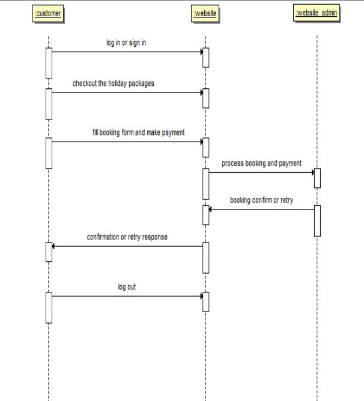

# **4d. USE CASE DIAGRAM**
A **use case diagram** at its simplest is a representation of a user's interaction with the system that shows the relationship between the user and the different [use](http://en.wikipedia.org/wiki/Use_Case) [cases](http://en.wikipedia.org/wiki/Use_Case) in which the user is involved. A use case diagram can identify the different types of users of a system and the different use cases and will often be accompanied by other types of diagrams as well.

So only static behavior is not sufficient to model a system rather dynamic behavior is more important than static behavior. In UML there are five diagrams available to model dynamic nature and use case diagram is one of them. Now as we have to discuss that the use case diagram is dynamic in nature there should be some internal or external factors for making the interaction.

These internal and external agents are known as actors. So use case diagrams are consists of actors, use cases and their relationships. The diagram is used to model the system/subsystem of an application. A single use case diagram captures a particular functionality of a system.

So to model the entire system numbers of use case diagrams are used.

The purpose of use case diagram is to capture the dynamic aspect of a system. But this definition is too generic to describe the purpose.

Because other four diagrams (activity, sequence, collaboration and State chart) are also having the same purpose. So we will look into some specific purpose which will distinguish it from other four diagrams.

Use case diagrams are used to gather the requirements of a system including internal and external influences. These requirements are mostly design requirements. So when a system is analyzed to gather its functionalities use cases are prepared and actors are identified.

Now when the initial task is complete use case diagrams are modelled to present the outside view.

So in brief, the purposes of use case diagrams can be as follows:

- Used to gather requirements of a system.
- Used to get an outside view of a system.
- Identify external and internal factors influencing the system.
- `	`Show the interacting among the requirements are actors. How to draw Use Case Diagram?

Use case diagrams are considered for high level requirement analysis of a system. So when the requirements of a system are analyzed the functionalities are captured in use cases.

So we can say that uses cases are nothing but the system functionalities written in an organized manner. Now the second things which are relevant to the use cases are the actors. Actors can be defined as something that interacts with the system.

The actors can be human user, some internal applications or may be some external applications. So in a brief when we are planning to draw a use case diagram we should have the following items identified.

- Functionalities to be represented as an use case
- Actors
- Relationships among the use cases and actors.

Use case diagrams are drawn to capture the functional requirements of a system. So after identifying the above items we have to follow the following guidelines to draw an efficient use case diagram.

- The name of a use case is very important. So the name should be chosen in such a way so that it can identify the functionalities performed.
- Give a suitable name for actors.

- Show relationships and dependencies clearly in the diagram.
- Do not try to include all types of relationships. Because the main purpose of the diagram is to identify requirements.
- Use note whenever required to clarify some important points.

**USE CASE DIAGRAM**

# **4.e MODULARIZATION DETAILS**
As Modularization has gained increasing focus from companies outside its traditional industries of aircraft and automotive, more and more companies turn to it as strategy and product development tool. I intend to explain the importance aspects of modularization and how it should be initiated within a company. After determining the theoretical steps of modularization success described in literature, I intend to conduct a multiple case study of companies who have implemented modularization in order to find how real world modularization was initiated and used to improve the company’s competitiveness.   By   combining   theory   and   practical   approach   to

modularization I will derive at convergence and divergence between

theoretical implementation to modularization and real world implementation to modularization. This gives a valuable input for both implantations in companies as well as new aspects to be further.

**DATA INTEGRITY AND CONSTRAINTS**

Data integrity is normally enforced in a [database system ](http://en.wikipedia.org/wiki/Database_system)by a series of [integrity](http://en.wikipedia.org/wiki/Integrity_constraints) [constraint](http://en.wikipedia.org/wiki/Integrity_constraints)s or rules. Three types of integrity constraints are an inherent part of the relational data model: entity integrity, referential integrity and domain

integrity:

- [*Entity integrity* ](http://en.wikipedia.org/wiki/Entity_integrity)concerns the concept of a [primary key](http://en.wikipedia.org/wiki/Primary_key)[. ](http://en.wikipedia.org/wiki/Primary_key)Entity integrity is an integrity rule which states that every table must have a primary key and

that the column or columns chosen to be the primary key should be unique and not null.

- `	`Concerns the concept of a [foreign key](http://en.wikipedia.org/wiki/Foreign_key)[. ](http://en.wikipedia.org/wiki/Foreign_key)The referential integrity rule states that any foreign-key value can only be in one of two states. The usual state of affairs is that the foreign-key value refers to a primary key value of some

table in the database.

Occasionally, and this will depend on the rules of the data owner, a foreign- key value can be [null](http://en.wikipedia.org/wiki/Null_\(SQL\))[. ](http://en.wikipedia.org/wiki/Null_\(SQL\))In this case we are explicitly saying that either there is no relationship between the objects represented in the database or that this relationship is unknown.

- *Domain integrity* specifies that all columns in a relational database must be declared upon a defined domain. The primary unit of data in the relational

data model is the data item. Such data items are said to be non-

decomposable or atomic. A domain is a set of values of the same type.

# **4f. DATABASE DESIGN**

A database is an organized mechanism that has capability of storing information through which a user can retrieve stored information in an effective and efficient manner. The data is the purpose of any database and must be protected.

The database design is two level processes. In the first step, user requirements are gathered together and a database is designed which will meet these requirements as clearly as possible. This step is called information Level design and it is taken independent of any individual DBMS.

In the following snapshots we display the way we have used MongoDB as the back-end Database for our project and the various entities that have been used along with their table definition and table data.

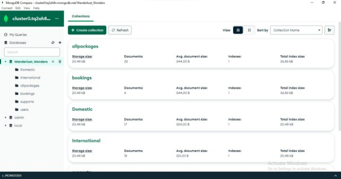

**OUTPUT SCREEN**

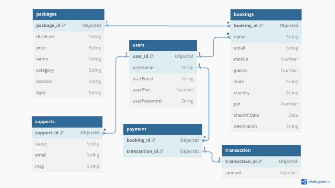

`  `**OUTPUT**

`   `**SCREENS**

# **5a. USER INTERFACE DESIGN**
**User interface design (UID)** or **user interface engineering** is the [design](http://en.wikipedia.org/wiki/Design) of user interface[s](http://en.wikipedia.org/wiki/User_interface) for [machines](http://en.wikipedia.org/wiki/Machine) and [software](http://en.wikipedia.org/wiki/Software)[,](http://en.wikipedia.org/wiki/Software) such as computers, [home](http://en.wikipedia.org/wiki/Home_appliance) [appliances](http://en.wikipedia.org/wiki/Home_appliance)[,](http://en.wikipedia.org/wiki/Home_appliance) [mobile devices](http://en.wikipedia.org/wiki/Mobile_device)[,](http://en.wikipedia.org/wiki/Mobile_device) and other [electronic](http://en.wikipedia.org/wiki/Electronics) [devices](http://en.wikipedia.org/wiki/Electronics)[,](http://en.wikipedia.org/wiki/Electronics) with the focus on maximizing the [user](http://en.wikipedia.org/wiki/User_experience) [experience](http://en.wikipedia.org/wiki/User_experience)[.](http://en.wikipedia.org/wiki/User_experience) The goal of user interface design is to make the user's interaction as simple and efficient as possible, in terms of accomplishing user goals ([user](http://en.wikipedia.org/wiki/User-centered_design)[centered design](http://en.wikipedia.org/wiki/User-centered_design)[)](http://en.wikipedia.org/wiki/User-centered_design).

Good user interface design facilitates finishing the task at hand without drawing unnecessary attention to it. [Graphic design ](http://en.wikipedia.org/wiki/Graphic_design)and typography are utilized to support its [usability](http://en.wikipedia.org/wiki/Usability)[,](http://en.wikipedia.org/wiki/Usability) influencing how the user performs certain interactions and improving the aesthetic appeal of the design; design aesthetics may enhance or detract from the ability of users to use the functions of the interface. The design process must balance technical functionality and visual elements (e.g., [mental model](http://en.wikipedia.org/wiki/Mental_model)[)](http://en.wikipedia.org/wiki/Mental_model) to create a system that is not only operational but also usable and adaptable to changing user needs.

Interface design is involved in a wide range of projects from computer systems, to cars, to commercial planes; all of these projects involve much of the same basic human interactions yet also require some unique skills and knowledge. As a result, designers tend to specialize in certain types of

projects and have skills centered on their expertise, whether that be software desig[n](http://en.wikipedia.org/wiki/Software_design)[, ](http://en.wikipedia.org/wiki/Software_design)user research, web desig[n](http://en.wikipedia.org/wiki/Web_design)[, ](http://en.wikipedia.org/wiki/Web_design)or [industrial design](http://en.wikipedia.org/wiki/Industrial_design)[.](http://en.wikipedia.org/wiki/Industrial_design)

### **FRONTEND**
**Home page**

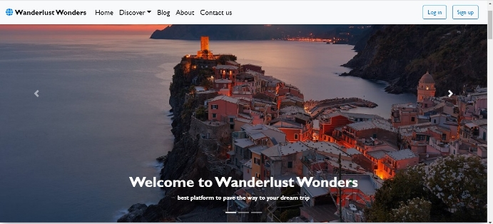

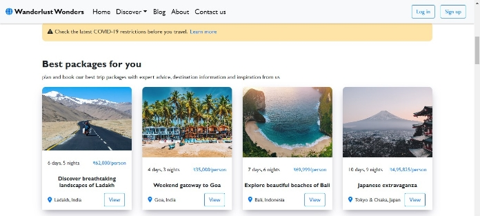

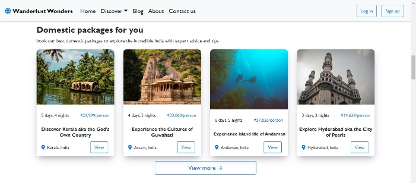

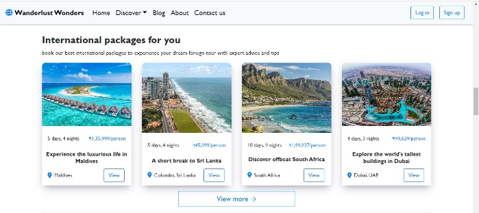

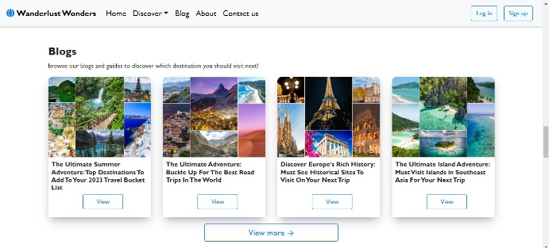

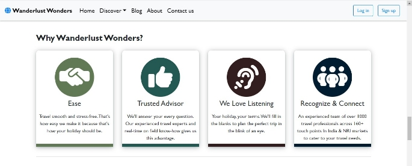

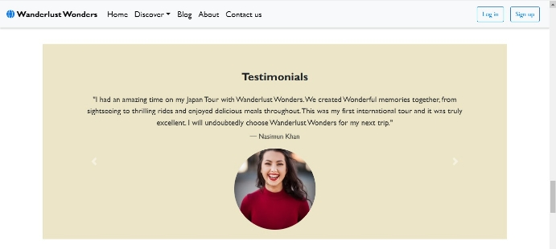

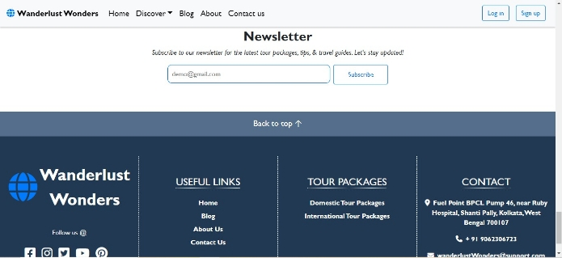

**Home.jsx**

import React, { useState } from "react";

import Menu from "../Menu/Menu.jsx";

import "../Menu/Menu.css";

import "./Home.css";

import { Link } from "react-router-dom";

import Footer from "../Footer/Footer.jsx";

const Home = () => {

`    `const [user, setUser] = useState({

`        `newsletterEmail: "",

`    `});

`    `const onValueChange = (e) => {

`        `setUser({ ...user, [e.target.name]: e.target.value });

`        `console.log(user);

`    `}

`    `const backToTop = () => {

`        `document.body.scrollTop = 0;

`        `document.documentElement.scrollTop = 0;

`    `}

`    `return (

`        `<>

`            `<Menu />

`            `{/\* slideshow \*/}

`            `

`                `<ol class="carousel-indicators">

`                    `<li data-target="#carouselExampleCaptions" data-slide-to="0" class="active"></li>

`                    `<li data-target="#carouselExampleCaptions" data-slide-to="1"></li>

`                    `<li data-target="#carouselExampleCaptions" data-slide-to="2"></li>

`                `</ol>

`                `

`                    `

`                        `

`                        `

`                            `<h1><b>Welcome to Wanderlust Wonders</b></h1>

`                            `
<b>best platform to pave the way to your dream trip</b>

`                        `

`                    `

`                    `

`                        `

`                        `

`                            `<h1><b>Explore the incredible India with us</b></h1>

`                            `
<b>through our domestic tour packages</b>

`                        `

`                    `

`                    `

`                        `

`                        `

`                            `<h1><b>Explore the beautiful world with us</b></h1>

`                            `
<b>through our international tour packages</b>

`                        `

`                    `

`                `

`                `<button class="carousel-control-prev" type="button" data-target="#carouselExampleCaptions"

data-slide="prev">

`                    `

`                    `Previous

`                `</button>

`                `<button class="carousel-control-next" type="button" data-target="#carouselExampleCaptions"

` `data-slide="next">

`                    `

`                    `Next

`                `</button>

`            `

`            `{/\* covid-restrictions \*/}

`            `

`                `

`                    `<i className="fa-solid fa-triangle-exclamation " id="covid-alert-icon"></i>

`                    `Check the latest COVID-19 restrictions before you travel.

`                    `<Link id="covid-alert-link" to="https://www.mea.gov.in/guidelines-for-international

-arrivals.htm" target="\_blank" alt="covid-guidelines" >

`                        `Learn more

`                    `</Link>

`                `

`            `

`            `{/\*best-packages \*/}

`            `

`                `

`                    `<h3><b>Best packages for you</b></h3>

`                    `
plan and book our best trip packages with expert advice, destination information and inspiration from us

`                    `

`                        `

`                            `

`                                `

`                                `
6 days, 5 nights₹62,000/person

`                                `<h6 className="text-center m-1"><b>Discover breathtaking landscapes of Ladakh</b></h6>

`                                `

`                                    `<i className="fa-solid fa-location-dot text-primary"></i>

`                                    `
 Ladakh, India

`                                    `<Link to="/ladakh" onClick={backToTop}>

`                                        `<input type="button" className="btn btn-outline-primary" value="View">

</input>

`                                    `</Link>

`                                `

`                            `

`                        `

`                        `

`                            `

`                                `

`                                `
4 days, 3 nights₹35,000/person

`                                `<h6 class="text-center m-1"><b>Weekend gateway to Goa</b></h6>

`                                `

`                                    `<i className="fa-solid fa-location-dot text-primary "></i>

`                                    `
 Goa, India

`                                    `<Link to="/goa" onClick={backToTop}>

`                                        `<input type="button" className="btn btn-outline-primary" value="View">

</input>

`                                    `</Link>

`                                `

`                            `

`                        `

`                        `

`                            `

`                                `

`                                `
7 days, 6 nights₹69,999/person

`                                `<h6 className="text-center m-1"><b>Explore beautiful beaches of Bali</b></h6>

`                                `

`                                    `<i className="fa-solid fa-location-dot text-primary "></i>

`                                    `
 Bali, Indonesia

`                                    `<Link to="/bali" onClick={backToTop}>

`                                        `<input type="button" className="btn btn-outline-primary" value="View">

</input>

`                                    `</Link>

`                                `

`                            `

`                        `

`                        `

`                            `

`                                `

`                                `
10 days, 9 nights₹4,95,825/person

`                                `<h6 className="text-center m-1"><b>Japanese extravaganza</b></h6>

`                                `

`                                    `<i className="fa-solid fa-location-dot text-primary "></i>

`                                    `
 Tokyo & Osaka, Japan

`                                    `<Link to="/japan" onClick={backToTop}>

`                                        `<input type="button" className="btn btn-outline-primary" value="View">

</input>

`                                    `</Link>

`                                `

`                            `

`                        `

`                    `

`                    `

`                `

`            `

`            `{/\* domestic-packages \*/}

`            `

`                `

`                    `<h3><b>Domestic packages for you</b></h3>

`                    `
book our best domestic packages to explore the incredible India with expert advice and 

tips

`                    `

`                        `

`                            `

`                                `

`                                `
5 days, 4 nights₹29,999/person

`                                `<h6 className="text-center m-1"><b>Discover Kerala aka the God's Own Country </b></h6>

`                                `

`                                    `<i className="fa-solid fa-location-dot text-primary"></i>

`                                    `
 Kerala, India

`                                    `<Link to="/kerala" onClick={backToTop}>

`                                        `<input type="button" className="btn btn-outline-primary" value="View">

</input>

`                                    `</Link>

`                                `

`                            `

`                        `

`                        `

`                            `

`                                `

`                                `
4 days, 3 nights₹33,869/person

`                                `<h6 className="text-center m-1"><b>Experience the Cultures of Guwahati</b>

</h6>

`                                `

`                                    `<i className="fa-solid fa-location-dot text-primary "></i>

`                                    `
 Assam, India

`                                    `<Link to="/guwahati" onClick={backToTop}>

`                                        `<input type="button" className="btn btn-outline-primary" value="View">

</input>

`                                    `</Link>

`                                `

`                            `

`                        `

`                        `

`                            `

`                                `

`                                `
6 days, 5 nights₹37,826/person

`                                `<h6 className="text-center mt-1 ml-1"><b style={{ fontSize: "15px" }}>

Experience island life of Andaman</b></h6>

`                                `

`                                    `<i className="fa-solid fa-location-dot text-primary"></i>

`                                    `
 Andaman, India

`                                    `<Link to="/andaman" onClick={backToTop}>

`                                        `<input type="button" className="btn btn-outline-primary" value="View">

</input>

`                                    `</Link>

`                                `

`                            `

`                        `

`                        `

`                            `

`                                `

`                                `
3 days, 2 nights₹19,629/person

`                                `<h6 className="text-center m-1"><b>Explore Hyderabad aka the City of Pearls</b></h6>

`                                `

`                                    `<i className="fa-solid fa-location-dot text-primary "></i>

`                                    `
 Hyderabad, India

`                                    `<Link to="/hyderabad" onClick={backToTop}>

`                                        `<input type="button" className="btn btn-outline-primary" value="View">

</input>

`                                    `</Link>

`                                `

`                            `

`                        `

`                    `

`                    `{/\* to view more domestic-packages \*/}

`                    `<Link className="view-more" to="/domestic" onClick={backToTop}>

`                        `<input type="button" className="btn btn-outline-primary " value="View more →">

</input>

`                    `</Link>

`                    `

`                `

`            `

`            `{/\* international-packages \*/}

`            `

`                `

`                    `<h3><b>International packages for you</b></h3>

`                    `
book our best international packages to experience your dream foreign tour with expert 

advice and tips

`                    `

`                    `

`                        `

`                            `

`                                `

`                                `
5 days, 4 nights₹1,35,999/person

`                                `<h6 className="text-center m-1"><b>Experience the luxurious life in Maldives</b></h6>

`                                `

`                                    `<i className="fa-solid fa-location-dot text-primary"></i>

`                                    `
Maldives

`                                    `<Link to="/maldives" onClick={backToTop}>

`                                        `<input type="button" className="btn btn-outline-primary" value="View">

</input>

`                                    `</Link>

`                                `

`                            `

`                        `

`                        `

`                            `

`                                `

`                                `
5 days, 4 nights₹45,999/person

`                                `<h6 className="text-center m-1"><b>A short break to Sri Lanka</b></h6>

`                                `

`                                    `<i className="fa-solid fa-location-dot text-primary "></i>

`                                    `
 Colombo, Sri Lanka

`                                    `<Link to="/colombo" onClick={backToTop}>

`                                        `<input type="button" className="btn btn-outline-primary" value="View">

</input>

`                                    `</Link>

`                                `

`                            `

`                        `

`                        `

`                            `

`                                `

`                                `
10 days, 9 nights₹1,99,927/person

`                                `<h6 className="text-center mt-0"><b>Discover offbeat South Africa</b></h6>

`                                `

`                                    `<i className="fa-solid fa-location-dot text-primary"></i>

`                                    `
 South Africa

`                                    `<Link to="/south\_africa" onClick={backToTop}>

`                                        `<input type="button" className="btn btn-outline-primary" value="View">

</input>

`                                    `</Link>

`                                `

`                            `

`                        `

`                        `

`                            `

`                                `

`                                `
4 days, 3 nights₹49,629/person

`                                `<h6 className="text-center m-1"><b>Explore the world's tallest buildings in Dubai</b></h6>

`                                `

`                                    `<i className="fa-solid fa-location-dot text-primary "></i>

`                                    `
 Dubai, UAE

`                                    `<Link to="/dubai" onClick={backToTop}>

`                                        `<input type="button" className="btn btn-outline-primary" value="View">

</input>

`                                    `</Link>

`                                `

`                            `

`                        `

`                    `

`                    `{/\* to view more international-packages \*/}

`                    `<Link className="view-more" to="/international" onClick={backToTop}>

`                        `<input type="button" className="btn btn-outline-primary " value="View more →">

</input>

`                    `</Link>

`                    `

`                `

`            `

`            `{/\* Blogs \*/}

`            `

`                `

`                    `<h3><b>Blogs</b></h3>

`                    `
browse our blogs and guides to discover which destination you should visit next!

`                    `

`                        `

`                            `

`                                `

`                                `<h6 className="text-left  m-2"><b>The Ultimate Summer Adventure: Top 

Destinations To Add To Your 2023 Travel Bucket List</b></h6>

`                                `<Link className="blog-button" to="/blog1" onClick={backToTop}>

`                                    `<input type="button" className="btn btn-outline-primary " value="View">

</input>

`                                `</Link>

`                            `

`                        `

`                        `

`                            `

`                                `

`                                `<h6 className="text-left  m-2"><b>The Ultimate Adventure: Buckle Up For 

The Best Road Trips In The World</b></h6>

`                                `<Link className="blog-button" to="/blog2" onClick={backToTop}>

`                                    `<input type="button" className="btn btn-outline-primary " value="View">

</input>

`                                `</Link>

`                            `

`                        `

`                        `

`                            `

`                                `

`                                `<h6 className="text-left  m-2"><b>Discover Europe's Rich History: Must See 

Historical Sites To Visit On Your Next Trip</b></h6>

`                                `<Link className="blog-button" to="/blog3" onClick={backToTop}>

`                                    `<input type="button" className="btn btn-outline-primary " value="View">

</input>

`                                `</Link>

`                            `

`                        `

`                        `

`                            `

`                                `

`                                `<h6 className="text-left  m-2"><b>The Ultimate Island Adventure: Must Visit

` `Islands in Southeast Asia For Your Next Trip</b></h6>

`                                `<Link className="blog-button" to="/blog4" onClick={backToTop}>

`                                    `<input type="button" className="btn btn-outline-primary " value="View">

</input>

`                                `</Link>

`                            `

`                        `

`                    `

`                    `{/\* to view more international-packages \*/}

`                    `<Link className="view-more" to="/blogs" onClick={backToTop}>

`                        `<input type="button" className="btn btn-outline-primary " value="View more →">

</input>

`                    `</Link>

`                    `

`                `

`            `

`            `{/\* features of our company \*/}

`            `

`                `

`                    `<h3><b>Why Wanderlust Wonders?</b></h3>

`                    `

`                        `

`                            `

`                                `

`                                    `

`                                        `<i className="fa-solid fa-handshake-simple features-icon mt-4" style={{ color: "white" }}></i>

`                                    `

`                                `

`                                `

`                                    `<h4 className="text-center">Ease</h4>

`                                    `
Travel smooth and stress-free. That's how easy

` `we make it because that's how your holiday should be.

`                                `

`                            `

`                        `

`                        `

`                            `

`                                `

`                                    `

`                                        `<i className="fa-solid fa-thumbs-up features-icon mt-4" style={{ color: "white" }}></i>

`                                    `

`                                `

`                                `

`                                    `<h4 className="text-center">Trusted Advisor</h4>

`                                    `
We'll answer your every question. Our

` `experienced travel experts and real-time on field know-how gives us this advantage.

`                                `

`                            `

`                        `

`                        `

`                            `

`                                `

`                                    `

`                                        `<i class="fa-solid fa-ear-listen features-icon mt-4" style={{ color: "white" }}>

</i>

`                                    `

`                                `

`                                `

`                                    `<h4 className="text-center">We Love Listening</h4>

`                                    `
Your holiday, your terms. We'll fill in the blanks

` `to plan the perfect trip in the blink of an eye.

`                                `

`                            `

`                        `

`                        `

`                            `

`                                `

`                                    `

`                                        `<i className="fa-solid fa-people-group features-icon mt-4" style={{ color: 

"white" }}></i>

`                                    `

`                                `

`                                `

`                                    `<h4 className="text-center">Recognize & Connect</h4>

`                                    `
An experienced team of over 1000 travel

` `professionals across 160+ touch points In India & NRI markets to cater to your travel needs.

`                                `

`                            `

`                        `

`                    `

`                    `

`                `

`            `

`            `{/Testimonilas-section/}

`            `

`                `

`                    `<h3 className="p-3"><b>Testimonials</b></h3>

`                    `

`                        `

`                            `

`                                `

`                                    `

`                                        `"I had an amazing time on my Japan Tour with Wanderlust Wonders.

`                                        `We created Wonderful memories together, from sightseeing to thrilling rides and enjoyed delicious meals throughout.

`                                        `This was my first international tour and it was truly excellent.

`                                        `I will undoubtedly choose Wanderlust Wonders for my next trip."

`                                    `

`                                    `
━ Nasimun Khan

`                                    `

`                                `

`                            `

`                            `

`                                `

`                                    `
“We have seen the vest of Ladakh on this tour, and the management was good and friendly.

`                                        `They helped and guided us in every possible way.

`                                        `Our dream tour was so smooth that we didn't even realise we were out of our hometown!”

`                                    `

`                                    `
━ Rahul Sharma

`                                    `

`                                `

`                            `

`                            `

`                                `

`                                    `

`                                        `“We joined the Scandinavia Tour with Wanderlust Wonders. Initially, there were lots of issues regarding visas, etc.

`                                        `But once we met our tour expert we slowly and steadily realized that we were in safe hands.

`                                        `We would like to travel with Wanderlust Wonders on the next trip as well.

`                                    `

`                                    `
━ Nick Archer

`                                    `

`                                `

`                            `

`                            `

`                                `

`                                    `

`                                        `“Great behaviour, great management. We didn't have to worry about anything.

`                                        `Such sincere behaviour cannot really be expected in this professional age.”

`                                    `

`                                    `
━ Aneesha Williams

`                                    `

`                                `

`                            `

`                        `

`                        `<button className="carousel-control-prev" type="button" data-target="#carouselExampleControls" data-slide="prev">

`                            `

`                            `Previous

`                        `</button>

`                        `<button className="carousel-control-next" type="button" data-target="#carouselExampleControls" data-slide="next">

`                            `

`                            `Next

`                        `</button>

`                    `

`                `

`            `

`            `

`                `

`                    `

`                        `<h2 ><b>Newsletter</b></h2>

`                        `
<i>Subscribe to our newsletter for the latest tour  

packages, tips, & travel guides. Let's stay updated!</i>

`                        `

`                            `<input name="newsletterEmail" onChange={onValueChange} type="email" placeholder="demo@gmail.com" style={{ border: "1px solid #007bff" }}></input>

`                            `<input className="btn btn-outline-primary newsletter-btn ml-2" type="submit" value={"Subscribe"}></input>

`                        `

`                    `

`                `

`            `

`            `<Footer />

`        `</>

`    `);

}

export default Home;

Home.css

.slide-conatiner {

`    `box-shadow: rgba(50, 50, 93, 0.25) 0px 13px 27px -5px, rgba(0, 0, 0, 0.3) 0px 8px 16px -8px;

}

.slide-conatiner img {

`    `margin-top: 10px;

`    `height: 620px;

`    `object-fit: cover;

}

/\* slideshow container frame \*/

/\* .carousel-item img {

`    `padding: 1%;

`    `padding-top: 0%;

} \*/

.covid-alert {

`    `background-color: #FFE4A7;

`    `width: 100%;

`    `padding: 15px;

`    `border-radius: 10px;

}

.covid-alert a {

`    `text-decoration: none;

}

.covid-alert #covid-alert-icon {

`    `margin-right: 5px;

}

.covid-alert #covid-alert-link {

`    `margin-left: 7px;

}

.card {

`    `height: 350px;

`    `border: none;

`    `border-radius: 10px 10px 0px 0px;

`    `box-shadow: rgba(50, 50, 93, 0.25) 0px 13px 27px -5px, rgba(0, 0, 0, 0.3) 0px 8px 16px -8px;

}

.card img {

`    `height: 200px;

`    `border-radius: 10px 10px 0px 0px;

`    `object-fit: cover;

}

.card p {

`    `font-size: 15px;

}

/\* to view the description of tour packages \*/

.card input {

`    `height: 10px;

`    `padding-bottom: 30px;

`    `position: absolute;

`    `bottom: 10px;

`    `right: 20px;

}

/\* location name  \*/

.card .location {

`    `position: absolute;

`    `bottom: 1px;

`    `left: 35px;

}

/\* view  more option to explore\*/

.view-more {

`    `display: flex;

`    `align-content: center;

`    `justify-content: center;

`    `text-decoration: none;

}

.view-more:hover {

`    `text-decoration: none;

}

/\* view  more button\*/

.view-more input {

`    `font-size: 20px;

`    `width: 30%;

}

.blog h2 {

`    `padding-top: 10px;

`    `display: flex;

`    `align-content: center;

`    `justify-content: center;

}

.blog-card img {

`    `height: 200px;

`    `object-fit: cover;

}

.blog-card .blog-button input {

`    `right: 32.5%;

`    `left: 34%;

`    `width: 100px;

`    `bottom: 20px;

}

.features-card {

`    `/\* background-color: white; \*/

`    `margin-top: 30px 0px 10px 10px;

`    `height: 320px;

`    `border-bottom: 10px solid #2f3d4d;

`    `border-radius: 10px 10px 0px 0px;

`    `box-shadow: rgba(14, 30, 37, 0.12) 0px 2px 4px 0px, rgba(14, 30, 37, 0.32) 0px 2px 16px 0px;

`    `align-content: center;

`    `justify-content: center;

}

/\* featurs-cirlce \*/

.circle {

`    `background: #2f3d4d;

`    `border-radius: 50%;

`    `width: 130px;

`    `height: 130px;

`    `font-size: 80px;

}

.testimonilas-conatiner {

`    `background-color: #ECE5C7;

`    `height: 480px;

}

.testimonilas-img {

`    `border-radius: 50%;

`    `width: 200px;

`    `height: 200px;

`    `object-fit: cover;

}

.testimonilas-img:hover {

`    `border: 10px solid #F6F6F6;

}

.testimonilas-quotes {

`    `font-size: 19px;

`    `font-weight: 20px;

}

.newsletter-conatiner input[type="email"] {

`    `width: 30%;

`    `padding: 10px;

}

/\* newsletter submit button \*/

.newsletter-btn {

`    `width: 10%;

`    `height: 48px;

}

@media(max-width:900px) {

.slide-conatiner img {

`        `object-fit: cover;

`        `margin-top: 55px;

`    `}

.carousel-item .caption h1,

`    `p {

`        `font-size: 10px;

`        `font-weight: 10px;

`    `}

.view-more input {

`        `width: auto;

`    `}

.testimonilas-conatiner {

`        `height: 600px;

`    `}

.features-text {

`        `font-size: auto;

`        `font-weight: auto;

`    `}

.newsletter-conatiner input[type="email"] {

`        `width: auto;

`        `padding: auto;

`    `}

.newsletter-btn {

`        `width: auto;

`        `height: auto;

`    `}

}

@media(max-width:500px) {

.slide-conatiner img {

`        `height: 180px;

`    `}

.carousel-item .caption h1,

`    `p {

`        `font-size: 10px;

`        `font-weight: 10px;

`    `}

.view-more input {

`        `width: auto;

`    `}

.testimonilas-conatiner {

`        `height: auto;

`    `}

.features-text {

`        `font-size: auto;

`        `font-weight: auto;

`    `}

.newsletter-conatiner input[type="email"] {

`        `width: auto;

`        `padding: auto;

`    `}

.newsletter-btn {

`        `width: auto;

`        `height: auto;

`    `}

}
##### **Footer**

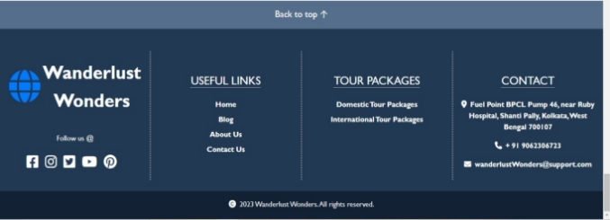

`	`**Footer.jsx**
**

import React from "react";

import "./Footer.css";

import { Link } from "react-router-dom";

const Footer = () => {

`    `const backToTop = () => {

`        `document.body.scrollTop = 0;

`        `document.documentElement.scrollTop = 0;

`    `}

`    `return (

`        `<>

`            `

`                `

`                    `

`                        `<h3 style={{ color: "white", fontSize: "20px" }} className="p-2 mt-2" onClick={backToTop}>Back to top ↑</h3>

`                    `

`                `

`            `

`            `

`                `<footer>

`                    `

`                        `

`                            `

`                                `<i className="fa-solid fa-globe" id="icon" style={{ fontSize: "70px" }}></i>

`                                `<strong style={{ marginLeft: "5px", color: "white", fontSize: "40px" }}>Wanderlust Wonders</strong>

`                            `

`                            `
Follow us @

`                            `<ul class="list-unstyled d-flex flex-row justify-content-center">

`                                `<li>

`                                    `<Link className="social-media-icons" to="https://www.facebook.com/WanderlustWonders" target="\_blank">

`                                        `<i className="fa-brands fa-square-facebook"></i>

`                                    `</Link>

`                                `</li>

`                                `<li >

`                                    `<Link className="social-media-icons" to="https://www.instagram.com/WanderlustWonders" target="\_blank">

`                                        `<i className="fa-brands fa-instagram"></i>

`                                    `</Link>

`                                `</li>

`                                `<li >

`                                    `<Link className="social-media-icons" to="https://twitter.com/

WanderlustWonders" target="\_blank">

`                                        `<i class="fa-brands fa-square-twitter"></i>

`                                    `</Link>

`                                    `<Link className="social-media-icons" to="https://www.youtube.com/@wanderlustwonders" target="\_blank">

`                                        `<i className="fa-brands fa-youtube"></i>

`                                    `</Link>

`                                    `<Link className="social-media-icons" to="https://www.pinterest.com/WanderlustWonders" target="\_blank">

`                                        `<i className="fa-brands fa-pinterest"></i>

`                                    `</Link>

`                                `</li>

`                            `</ul>

`                        `

`                        `

`                            `<h5 className="text-uppercase mt-5 mb-4">

`                                `Useful Links</h5>

`                            `<ul className="list-unstyled">

`                                `<li className="mb-2 font-weight-bold ">

`                                    `<Link to="/" className="text-white text-decoration-none" onClick={backToTop}>

`                                        `Home

`                                    `</Link>

`                                `</li>

`                                `<li class="mb-2 font-weight-bold ">

`                                    `<Link to="/blogs" class="text-white text-decoration-none" onClick={backToTop}>

`                                        `Blog

`                                    `</Link>

`                                `</li>

`                                `<li class="mb-2 font-weight-bold ">

`                                    `<Link to="/about" class="text-white text-decoration-none" onClick={backToTop}>

`                                        `About Us

`                                    `</Link>

`                                `</li>

`                                `<li class="mb-2 font-weight-bold ">

`                                    `<Link to="/contact" class="text-white text-decoration-none" onClick=

{backToTop}>

`                                        `Contact Us

`                                    `</Link>

`                                `</li>

`                            `</ul>

`                        `

`                        `

`                            `<h5 className="text-uppercase mt-5 mb-4">

`                                `Tour packages</h5>

`                            `<ul className="list-unstyled">

`                                `<li class="mb-2 font-weight-bold ">

`                                    `<Link to="/domestic" className="text-white text-decoration-none" onClick={backToTop}>

`                                        `Domestic Tour Packages

`                                    `</Link>

`                                `</li>

`                                `<li class="mb-2 font-weight-bold ">

`                                    `<Link to="/international" class="text-white text-decoration-none" onClick={backToTop}>

`                                        `International Tour Packages

`                                    `</Link>

`                                `</li>

`                            `</ul>

`                        `

`                        `

`                            `<h5 className="text-uppercase mt-5 mb-4">

`                                `Contact</h5>

`                            `<ul className="list-unstyled">

`                                `<li className="font-weight-bold">

`                                    `<Link target="\_blank" to="https://www.google.com/maps/place/BP+PUMP/@22.5137885,88.3954661,17z/data=!4m10!1m2!

2m1!1sFuel+Point+BPCL+Pump+46,+near+Ruby+Hospital,+Shanti+Pally,+Kolkata,+West+Bengal+

700107!3m6!1s0x3a02715576b29b79:0x57762e0466f63983!8m2!3d22.5137885!4d88.3999722!15sC

lZGdWVsIFBvaW50IEJQQ0wgUHVtcCA0NiwgbmVhciBSdWJ5IEhvc3BpdGFsLCBTaGFudGkgU

GFsbHksIEtvbGthdGEsIFdlc3QgQmVuZ2FsIDcwMDEwNyIDiAEBkgELZ2FzX3N0YXRpb27gAQ

A!16s%2Fg%2F11hbg8n1h2?entry=ttu" className="text-white text-decoration-none"> 

`                                        `<i className="fa-solid fa-location-dot mr-2 "></i>

`                                        `Fuel Point BPCL Pump 46, near Ruby Hospital, Shanti Pally, Kolkata, 

West Bengal 700107

`                                    `
</Link>

`                                `</li>

`                                `<li className="font-weight-bold">

`                                    `<Link to={"tel:+919062306723"} className="text-white text-decoration-none">

<i className="fa-solid fa-phone mr-2 "></i>+ 91 9062306723
</Link>

`                                `</li>

`                                `<li className="font-weight-bold">

`                                    `<Link to={"mailto:wanderlustWonders@support.com"} className="text-white

` `text-decoration-none ">
<i class="fa-solid fa-envelope mr-2"></i>wanderlustWonders@support.com
</Link>

`                                `</li>

`                            `</ul>

`                        `

`                    `

`                `</footer>

`            `

`            `

`                `

`                    `

`                        `
<i className="fa-solid fa-copyright mr-2"></i>{new Date().getFullYear()} Wanderlust Wonders. All rights reserved. 

`                    `

`                `

`            `

`        `</>

`    `);

}

export default Footer;

**Footer.css**

.footer-upper-conatiner {

`    `margin-top: 50px;

`    `background-color: #556e8b;

`    `height: 60px;

`    `cursor: pointer;

}

.footer-upper-conatiner:hover {

`    `background-color: rgb(99, 123, 148);

}

.footer-conatiner {

`    `background-color: #223953;

}

.footer-conatiner .social-media-icons {

`    `color: white;

`    `margin-right: 15px;

`    `font-size: 30px;

}

.footer-conatiner .social-media-icons:hover {

`    `color: #007bff;

}

.footer-lower-conatiner{

`    `background-color: #122133;

`    `height: 60px;

}

`  	`**Login Page**

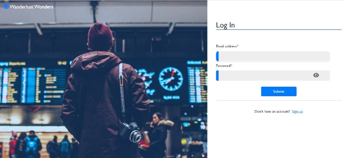

`	`**LogIn.jsx**

import React, { useContext, useEffect, useState } from "react";

import "./LogIn.css";

import { Link } from "react-router-dom";

import { ToastContainer, toast } from "react-toastify";

import { getUser } from "../../service/api";

import { UserContext } from "../../App";

const LogIn = () => {

`    `const { state, dispatch } = useContext(UserContext);

`    `const [login, setLogin] = useState({

`        `email: "",

`        `password: ""

`    `});

`    `const [users, setUser] = useState([]);

`    `useEffect(() => {

`        `getAllUsers();

`    `}, []);

`    `const getAllUsers = async () => {

`        `let response = await getUser();

`        `setUser(response.data);

`    `}

`    `const onValueChange = async (e) => {

`        `setLogin({ ...login, [e.target.name]: e.target.value });

`        `console.log(login);

`    `}

`    `const showPassword = () => {

`        `if (document.getElementsByName("password")[0].type === "password") {

`            `document.getElementsByName("password")[0].type = "text";

`        `} else {

`            `document.getElementsByName("password")[0].type = "password";

`        `}

`    `}

`    `const submitButton = async (e) => {

`        `e.preventDefault();

`        `const { email, password } = login;

`        `if (!email || email.slice(-10) !== "@gmail.com") {

`            `document.getElementsByClassName("mandatory-field")[0].style.display = "block";

`            `toast.error("Enter a valid email address!");

`        `} else if (!password) {

`            `document.getElementsByClassName("mandatory-field")[1].style.display = "block";

`            `toast.error("Enter valid password!");

`        `} else {

`            `for (let i = 0; i < users.length; i++) {

`                `if (users[i].userEmail === email && password === users[i].userPassword) {

`                    `dispatch({ type: "USER", payload: true });

`                    `window.location.href = "/";

`                `}

`            `}

`            `toast.error("Please enter valid username & password");

`        `}

`    `}

`    `return (

`        `<>

`            `

`                `

`                    `

`                        `<Link to="/">

`                            `<h1 className="msg">

`                                `<i className="fa-solid fa-globe mr-1" id="icon"></i>

`                                `Wanderlust Wonders</h1>

`                        `</Link>

`                        `</img>

`                    `

`                    `

`                        `

`                            `<h1 className="mb-5" style={{ borderBottom: "1px solid #007bff" }}>Log In</h1>

`                            `<form className="login-form">

`                                `

`                                    `

`                                        `<label htmlFor="userEmail" className="login-label" >Email address\*</label>

`                                        `<input name="email" type="email" className="form-control" id="userEmail"

` `aria-describedby="emailHelp" autoComplete="false" onChange={onValueChange} />

`                                        `<i style={{ color: 'red' }}>enter your email \*</i>

`                                    `

`                                `

`                                `

`                                    `

`                                        `<label htmlFor="exampleInputPassword1" className="login-label">Password

\*</label>

`                                        `<input id="exampleInputPassword1" name="password" type="password" className="form-control" onChange={onValueChange} autoComplete="false" />

`                                        `<i style={{ cursor: "pointer" }} onClick={showPassword} className="fa-solid 

fa-eye eye-symbol-login"></i>

`                                        `<i style={{ color: 'red' }}>enter your 

password \*</i>

`                                    `

`                                `

`                                `

`                                    `

`                                        `<button type="submit" onClick={submitButton} className="btn btn-primary submit-button">Submit</button>

`                                    `

`                                `

`                                `

`                                `

`                                    `

`                                        `<label htmlFor="exampleInputEmail1" className="text">Don't have an account?</label>

`                                        `<Link to="/signup" className="ml-2 text" id={"sign-up-btn"} style={{ textDecoration: "underline" }}>Sign up</Link>

`                                    `

`                                    `<ToastContainer position="top-center" />

`                                `

`                            `</form>

`                        `

`                    `

`                `

`            `

`        `</>

`    `);

}

export default LogIn;

**LogIn.css**

.main-body .login-container {

`    `display: flex;

`    `height: 100vh;

`    `width: 100%;

}

.main-body .login-container .left-part {

`    `background-color: #007bff;

`    `height: 100%;

`    `width: 60%;

`    `z-index: 1;

}

.main-body .login-container .right-part {

`    `background-color: white;

`    `height: 100%;

`    `width: 40%;

`    `font-size: 20px;

`    `padding-top: 80px;

`    `padding-left: 20px;

`    `position: relative;

}

.login-container .left-part .msg {

`    `position: absolute;

`    `color: white;

`    `z-index: 2;

`    `font-size: 20px;

`    `top: 2%;

`    `left: 1%;

`    `font-weight: 10;

}

.login-container .left-part img {

`    `height: 100%;

`    `width: 100%;

`    `object-fit: cover;

`    `opacity: 0.8;

`    `z-index: -1;

}

.login-container .right-part h1 {

`    `font-size: 30px;

}

.login-form .login-group input {

`    `width: 450px;

`    `border: none;

`    `border-left: 10px solid #007bff;

`    `background-color: #EEEEEE;

`    `height: 40px;

}

.login-form .login-group input:hover {

`    `border-left: 10px solid #007bff;

`    `background-color: #EEEEEE;

}

.submit-button {

`    `width: 140px;

}

.login-label {

`    `font-size: 15px;

}

.footer-text .text {

`    `font-size: 15px;

}

.eye-symbol-login{

`    `position: absolute;

`    `left: 400px;

`    `top: 45px;

`    `color: rgb(90, 90, 90);

}

.mandatory-field{

`    `font-size: 13px;

`    `letter-spacing: 2px;

`    `font-weight: 500;

`    `display: none;

}

@media(max-width:1075px) {

.login-container .left-part img {

`        `object-fit: cover;

`    `}

.main-body .login-form .login-group input {

`        `width: 350px;

`    `}

}

@media(max-width:950px) {

.login-container .left-part img {

`        `object-fit: cover;

`    `}

.main-body .login-form .login-group input {

`        `width: 250px;

`    `}

}

@media(width:912px) {

.login-container .left-part img {

`        `object-fit: cover;

`    `}

.main-body .login-form .login-group input {

`        `width: 300px;

`    `}

}

@media(width:540px) {

.login-container .left-part img {

`        `object-fit: cover;

`    `}

.main-body .login-form .login-group input {

`        `width: 150px;

`    `}

}

@media(max-width:450px) {

.main-body .login-container .left-part {

`        `width: 40%;

`    `}

.main-body .login-container .right-part {

`        `width: 60%;

`    `}

.main-body .login-form .login-group input {

`        `width: 200px;

`    `}

.login-container .left-part img {

`        `object-fit: cover;

`    `}

.footer-text {

`        `max-width: 1000px;

`        `font-size: 5px;

`    `}

}

@media(width:375px) {

.main-body .login-form .login-group input {

`        `width: 150px;

`    `}

.login-container .left-part img {

`        `object-fit: cover;

`    `}

}

@media(max-width:400px) {

.main-body .login-form .login-group input {

`        `width: 170px;

`    `}

.login-container .left-part img {

`        `object-fit: cover;

`    `}

}

@media(max-width:600px) {

.main-body .login-container .left-part .msg{

`        `font-size: 10px;

`    `}

.footer-text{

`        `max-width: 200px;

`        `font-size: 5px;

`    `}

}

**Signup Page**

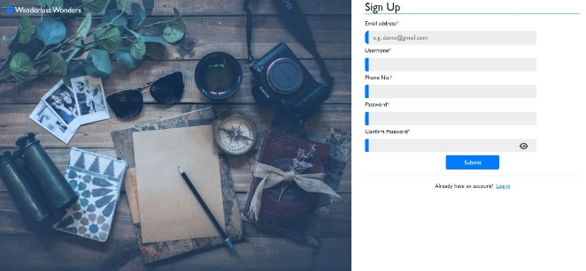

`	`**SignUp.jsx**

import { useState,useContext } from "react";

import React from "react";

import "./SignUp.css";

import { Link, useNavigate } from "react-router-dom";

import { ToastContainer, toast } from "react-toastify";

import { addUser } from "../../service/api"

import { UserContext } from "../../App";

const SignUp = () => {

`    `const [user, setUser] = useState({

`        `userEmail: "",

`        `userName: "",

`        `userPhn: "",

`        `userPassword: "",

`        `userConfirmPassword: ""

`    `});

`    `const { state, dispatch } = useContext(UserContext);

`    `const onValueChange = async (e) => {

`        `setUser({ ...user, [e.target.name]: e.target.value });

`        `console.log(user);

`    `}

`    `const showPassword = () => {

`        `if (document.getElementById("userConfirmPassword").type === "password") {

`            `document.getElementById("userConfirmPassword").type = "text";

`        `} else {

`            `document.getElementById("userConfirmPassword").type = "password";

`        `}

`    `}

`    `const navigate = useNavigate();

`    `const submitButton = async (e) => {

`        `e.preventDefault();

`        `const { userEmail, userName, userPhn, userPassword, userConfirmPassword } = user;

`        `if (!userEmail) {

`            `toast.error("Enter a valid email address!");

`        `} else if (userEmail.slice(-10) !== "@gmail.com") {

`            `toast.error("Enter a valid email address!");

`        `} else if (!userName) {

`            `toast.error("Enter username!");

`        `} else if (!userPhn) {

`            `toast.error("Enter phone number!");

`        `} else if (userPhn.length < 10 || userPhn.length > 10) {

`            `toast.error("Enter a valid phone number!");

`        `}

`        `else if (!userPassword) {

`            `toast.error("Enter a password!");

`        `} else if (!userConfirmPassword) {

`            `toast.error("Enter the password again to confirm!");

`        `} else if (userPassword !== userConfirmPassword) {

`            `toast.error("Confirm password isn't same with password!");

`        `} else {

`            `const formData = new FormData();

`            `formData.append('userEmail', user.userEmail);

`            `formData.append('userName', user.userName);

`            `formData.append("userPhn", user.userPhn);

`            `formData.append("userPassword", user.userPassword);

`            `formData.append("userConfirmPassword", user.userConfirmPassword);

`            `const res = await addUser(formData);

`            `if (res.status === 201) {

`                `toast.success("Welcome to Wonderlust Wonders!");

`                `dispatch({ type: "USER", payload: true });

`                `setTimeout(() => {

`                    `navigate("/");

`                `}, 6000);

`            `}

`            `else {

`                `toast.error("Something went wrong, please try again later!");

`            `}

`        `}

`    `}

`    `return (

`        `<>

`            `

`                `

`                    `

`                        `<Link to="/">

`                            `<h1 className="msg">

`                                `<i className="fa-solid fa-globe mr-1" id="icon"></i>

`                                `Wanderlust Wonders</h1>

`                        `</Link>

`                        `</img>

`                    `

`                    `

`                        `

`                            `<h1 className="mb-2" style={{ borderBottom: "1px solid #007bff" }}>Sign Up</h1>

`                            `<form className="signup-form">

`                                `

`                                    `

`                                        `<label htmlFor="userEmail" className="signup-label" >Email address\*</label>

`                                        `<input type="email" class="form-control user-mandatory-fields" name=

"userEmail" onChange={onValueChange} id="userEmail" placeholder="e.g. demo@gmail.com" aria-describedby="emailHelp" />

`                                    `

`                                `

`                                `

`                                    `

`                                        `<label htmlFor="" className="signup-label">Username\*</label>

`                                        `<input type="text" class="form-control user-mandatory-fields" name=

"userName" onChange={onValueChange} id="userName" aria-describedby="emailHelp" />

`                                    `

`                                `

`                                `

`                                    `

`                                        `<label htmlFor="userPhn" className="signup-label">Phone No.\*</label>

`                                        `<input type="text" class="form-control" name="userPhn" onChange={onValueChange} id="userPhn" aria-describedby="emailHelp" />

`                                    `

`                                `

`                                `

`                                    `

`                                        `<label htmlFor="userPassword" className="signup-label">Password\*</label>

`                                        `<input type="password" class="form-control" name="userPassword" onChange={onValueChange} id="userPassword" />

`                                    `

`                                `

`                                `

`                                    `

`                                        `<label htmlFor="userConfirmPassword" className="signup-label">Confirm Password\*</label>

`                                        `<input id="userConfirmPassword" name="userConfirmPassword" 

onChange={onValueChange} type="password" class="form-control" />

`                                        `<i style={{ cursor: "pointer" }} onClick={showPassword} class="fa-solid 

fa-eye eye-symbol-signup"></i>

`                                    `

`                                `

`                                `

`                                    `

`                                        `<button type="submit" class="btn btn-primary submit-button" onClick={submitButton}>Submit</button>

`                                    `

`                                `

`                                `<ToastContainer position="top-center" />

`                                `

`                                `

`                                    `

`                                        `<label for="exampleInputEmail1" className="text">Already have an account?</label>

`                                        `<Link to="/login" className="ml-2 text" style={{ textDecoration: "underline" }}>Log in</Link>

`                                    `

`                                `

`                            `</form>

`                        `

`                    `

`                `

`            `

`        `</>

`    `);

}

export default SignUp;

**SignUp.css**

.main-body .signup-container {

`    `display: flex;

`    `height: 100vh;

`    `width: 100%;

}

.main-body .signup-container .left-part {

`    `background-color: #007bff;

`    `height: 100%;

`    `width: 60%;

`    `z-index: 1;

}

.main-body .signup-container .right-part {

`    `background-color: white;

`    `height: 100%;

`    `width: 40%;

`    `font-size: 20px;

`    `padding-left: 20px;

}

.signup-container .left-part .msg {

`    `position: absolute;

`    `color: white;

`    `z-index: 2;

`    `font-size: 20px;

`    `top: 2%;

`    `left: 1%;

`    `font-weight: 10;

}

.signup-container .left-part img {

`    `height: 100%;

`    `width: 100%;

`    `object-fit: cover;

`    `opacity: 0.8;

`    `z-index: -1;

}

.signup-container .right-part h1 {

`    `font-size: 30px;

}

.signup-form .signup-group input {

`    `width: 450px;

`    `border: none;

`    `border-left: 10px solid #007bff;

`    `background-color: #EEEEEE;

`    `height: 35px;

}

.signup-form .signup-group input:hover {

`    `border-left: 10px solid #007bff;

`    `background-color: #EEEEEE;

}

.signup-label {

`    `font-size: 15px;

}

.footer-text .text {

`    `font-size: 15px;

}

.eye-symbol-signup {

`    `position: absolute;

`    `left: 420px;

`    `top: 45px;

`    `color: rgb(90, 90, 90);

}

@media(max-width:1075px) {

.signup-container .left-part img {

`        `object-fit: cover;

`    `}

.main-body .signup-form .signup-group input {

`        `width: 350px;

`    `}

}

@media(max-width:950px) {

.signup-container .left-part img {

`        `object-fit: cover;

`    `}

.main-body .signup-form .signup-group input {

`        `width: 250px;

`    `}

.eye-symbol-signup {

`        `left: 200px;

`    `}

}

@media(width:912px) {

.signup-container .left-part img {

`        `object-fit: cover;

`    `}

.main-body .signup-form .signup-group input {

`        `width: 300px;

`    `}

.eye-symbol-signup {

`        `left: 260px;

`    `}

}

@media(width:540px) {

.signup-container .left-part img {

`        `object-fit: cover;

`    `}

.main-body .signup-form .signup-group input {

`        `width: 150px;

`    `}

.eye-symbol-signup {

`        `left: 135px;

`    `}

}

@media(max-width:450px) {

.main-body .signup-container .left-part {

`        `width: 40%;

`    `}

.main-body .signup-container .right-part {

`        `width: 60%;

`    `}

.main-body .signup-form .signup-group input {

`        `width: 200px;

`    `}

.signup-container .left-part img {

`        `object-fit: cover;

`    `}

.footer-text {

`        `max-width: 1000px;

`        `font-size: 5px;

`    `}

.eye-symbol-signup {

`        `left: 140px;

`    `}

}

@media(width:375px) {

.main-body .signup-form .signup-group input {

`        `width: 150px;

`    `}

.signup-container .left-part img {

`        `object-fit: cover;

`    `}

}

@media(max-width:400px) {

.main-body .signup-form .signup-group input {

`        `width: 170px;

`    `}

.signup-container .left-part img {

`        `object-fit: cover;

`    `}

}

@media(max-width:600px) {

.main-body .signup-container .left-part .msg {

`        `font-size: 10px;

`    `}

.footer-text {

`        `max-width: 200px;

`        `font-size: 5px;

`    `}

}

@media (width:1024px) {

.eye-symbol-signup {

`        `left: 320px;

`    `}

}

**Contact Us Page**

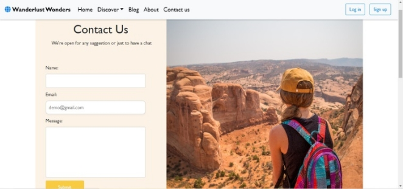

**Contact.jsx**

import React, { useState } from 'react';

import './Contact.css';

import Menu from '../Menu/Menu';

import Footer from '../Footer/Footer';

import { toast, ToastContainer } from "react-toastify";

import "react-toastify/dist/ReactToastify.css";

import { addSupport } from "../../service/api"

import { useNavigate } from 'react-router-dom';

const Contact = () => {

`  `const [support, setSupport] = useState({

`    `name: "",

`    `email: "",

`    `msg: "",

`  `});

`  `const onValueChange = (e) => {

`    `setSupport({ ...support, [e.target.name]: e.target.value });

`    `console.log(support);

`  `}

`  `const navigate = useNavigate();

`  `const handleSubmit = async (e) => {

`    `e.preventDefault();

`    `const { name, email, msg } = support;

`    `if (!name) {

`      `toast.warn("Enter your name!");

`    `} else if (!email) {

`      `toast.warn("Enter your email!");

`    `} else if (!msg) {

`      `toast.warn("Enter your query!");

`    `} else {

`      `const formData = new FormData();

`      `formData.append("name", support.name);

`      `formData.append("email", support.email);

`      `formData.append("msg", support.msg);

`      `const res = await addSupport(formData);

`      `if (res.status === 201) {

`        `toast.success("Thanks for contacting us, We'll get back to you shortly!",{

`          `position:"top-center",

`        `});

`        `setTimeout(() => {

`          `navigate(0);

`        `}, 6000);

`      `}

`      `else {

`        `toast.error("Something went wrong, please try again later!",{

`          `position:"top-center",

`        `});

`      `}

`    `}

`  `};

`  `return (

`    `<>

`      `<Menu />

`      `<ToastContainer />

`      `

`        `

`          `

`            `<h1>Contact Us</h1>

`            `

`              `<h6>We're open for any suggestion or just to have a chat</h6>

`            `

`            `

`              `<form onSubmit={handleSubmit} className='contact-form'>

`                `<label htmlFor="name-contact">Name:</label>

`                `<input onChange={onValueChange} name='name' type="text" id="name-contact" />

`                `<label htmlFor="email-contact">Email:</label>

`                `<input onChange={onValueChange} name='email' type="email" id="email-contact" placeholder="demo@gmail.com" />

`                `<label htmlFor="message-contact">Message:</label>

`                `<textarea onChange={onValueChange} name='msg' id="message-contact" maxLength={350} style={{ height: '167px', resize: 'none' }} ></textarea>

`                `<button type="submit">Submit</button>

`              `</form>

`            `

`          `

`        `

`        `

`          `

`        `

`      `

`      `

`        `<iframe src="https://www.google.com/maps/embed?pb=!1m14!1m8!1m3!1d3685.7439372415533!2d88.3954661

!3d22.5137885!3m2!1i1024!2i768!4f13.1!3m3!1m2!1s0x3a02715576b29b79%3A0x57762e0466f63983

!2sBP%20PUMP!5e0!3m2!1sen!2sin!4v1689509968242!5m2!1sen!2sin"

`          `width="100%" title='g-map' height="410" style={{ border: 0 }} allowfullscreen="" loading="lazy" referrerpolicy="no-referrer-when-downgrade"></iframe>

`      `

`      `

`        `<Footer />

`      `

`    `</>

`  `);

}

export default Contact;

**Contact.css**

.contact-page {

`  `margin-top: 70px;

}

.contact-page .contactpage-leftside {

`  `width: 40%;

`  `height: 600px;

`  `background-color: #fcf2e5;

}

.contact-page .contactpage-rightside {

`  `width: 60%;

`  `height: 600px;

}

.contactpage-header {

`  `display: flex;

`  `align-items: center;

`  `justify-content: center;

`  `margin-top: 10px;

}

.contact-page .contactpage-leftside .contactpage-content {

`  `position: absolute;

`  `top: 150px;

`  `left: 50px;

}

.contact-page .contactpage-leftside .contactpage-texts h6 {

`  `position: absolute;

`  `top: 70px;

`  `left: 70px;

}

.contact-page {

`  `display: flex;

`  `position: absolute;

`  `top: 55%;

`  `left: 50%;

`  `/\* divides from left right and top bottom equally \*/

`  `transform: translate(-50%, -50%);

}

.contact-form {

`  `display: flex;

`  `flex-direction: column;

`  `max-width: 400px;

}

.contact-form input,

.contact-form textarea {

`  `margin-bottom: 10px;

`  `padding: 10px;

`  `border: 1px solid #ccc;

`  `border-radius: 4px;

`  `width: 170%;

}

.contact-form button {

`  `padding: 10px 20px;

`  `background-color: #f9cb42;

`  `color: #fff;

`  `border: none;

`  `border-radius: 4px;

`  `width: 130px;

`  `cursor: pointer;

}

.contact-form button:hover {

`  `background-color: #deb027;

`  `transition: 1s;

}

@media (max-width:360px) {

.contactpage-header h1 {

`    `font-size: 30px;

`  `}

}

@media screen and (max-width:768px) {

.contact-page .contactpage-leftside {

`    `width: 60%;

`  `}

.contact-page .contactpage-rightside {

`    `width: 40%;

`  `}

.contact-page .contactpage-leftside .contactpage-texts h6:last-child {

`    `left: 20px;

`    `font-size: 8px;

`  `}

.contact-form {

`    `font-size: 11px;

`    `width: 100px;

`    `position: absolute;

`    `left: -30px;

`  `}

}

@media (max-width:820px) {

.contact-page .contactpage-leftside .contactpage-texts h6 {

`    `left: 30px;

`  `}

.contact-page .contactpage-leftside {

`    `width: 55%;

`  `}

.contact-page .contactpage-rightside {

`    `width: 45%;

`  `}

}

@media (max-width:912px) {

.contact-page .contactpage-leftside {

`    `width: 55%;

`  `}

.contact-page .contactpage-rightside {

`    `width: 45%;

`  `}

.contact-page .contactpage-leftside .contactpage-texts h6 {

`    `left: 30px;

`  `}

}

@media (max-width:1024px) {

.contact-page {

`    `padding: 10px;

`  `}

.contactpage-header h1 {

`    `padding-top: 35px;

`  `}

.contact-page .contactpage-leftside .contactpage-texts h6 {

`    `top: 110px;

`  `}

.contact-page .contactpage-leftside {

`    `width: 55%;

`  `}

.contact-page .contactpage-rightside {

`    `width: 45%;

`  `}

}

.forfooter {

`  `position: absolute;

`  `top: 180%;

`  `width: 100%;

}

.g-map {

`  `position: absolute;

`  `top: 120%;

`  `width: 100%;

}

@media (width:1024px) {

.forfooter {

`    `width: max-content;

`  `}

.g-map {

`    `width: max-content;

`  `}

}

**About Us Page**

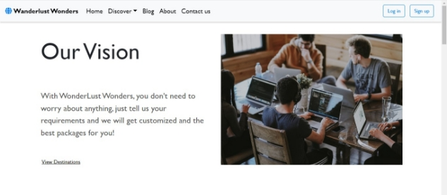

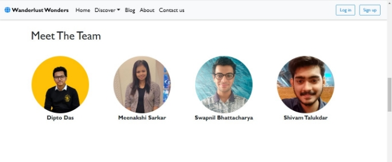

**About.jsx**

import React from 'react';

import Menu from '../Menu/Menu';

import './About.css';

import { Link } from 'react-router-dom';

import Footer from '../Footer/Footer';

// import Footer from '../Footer/Footer';

const AboutUs = () => {

`  `const backToTop = () => {

`    `document.body.scrollTop = 0;

`    `document.documentElement.scrollTop = 0;

}

`  `return (

`    `<>

`      `<Menu />

`      `{/\* For the Our Vision  \*/}

`      `

`        `

`          `

`            `<h3>Our Vision</h3>

`          `

`          `

`            `
With WonderLust Wonders, you don't need to worry about anything, just tell us 

your requirements and we will

`              `get customized and the best packages for you!

`            `

`              `<Link className='about-button' to='/'>

`                `<input type='button' className='btn view-destination btn-link' value='View Destinations' onClick={backToTop}></input>

`              `</Link>

`            `

`          `

`        `

`        `

`          `

`        `

`      `

`      `{/\* Numbers and Percentage in page \*/}

`      `

`        `

`          `

`            `

`              `<h1><b>99%</b></h1>

`              `
<b>Travelers recommend us to friends and family</b>

`            `

`          `

`          `

`            `

`              `<h1><b>1000+</b></h1>

`              `
<b>Successful Tours Completed</b>

`            `

`          `

`          `

`            `

`              `<h1><b>24/7</b></h1>

`              `
<b>Service available</b>

`            `

`          `

`        `

`        `

`      `

`      `

`        `

`          `

`            `<h3>Our Story</h3>

`          `

`          `

`            `
Welcome to Wanderlust Wonders, your gateway to extraordinary journeys and unforgettable experiences. We are here to

`              `inspire your adventurous spirit and take you on a captivating voyage across the globe. 

Whether you seek breathtaking

`              `landscapes, cultural immersion, or thrilling escapades, our expertly crafted tours and travel 

packages cater to all your

`              `wanderlust desires. Immerse yourself in the vibrant tapestry of diverse cultures, delve into 

the hidden gems of ancient cities,

`              `and savor the flavors of exotic cuisines. With Wanderlust Wonders, embark on a journey of

` `a lifetime, where every step unveils

`              `a new wonder and every moment creates cherished memories. Let us guide you to the 

extraordinary and ignite your passion

`              `for travel.

`          `

`        `

`        `

`          `

`        `

`      `

`      `

`        `<h1>Meet The Team</h1>

`      `

`      `

`        `

`          `

`            `

`              `

`              `
<b>Dipto Das</b>

`            `

`          `

`          `

`            `

`              `

`              `
<b>Meenakshi Sarkar</b>

`            `

`          `

`          `

`            `

`              `

`              `
<b>Swapnil Bhattacharya</b>

`            `

`          `

`          `

`            `

`              `

`              `
<b>Shivam Talukdar</b>

`            `

`          `

`        `

`      `

`      `

`        `<Footer />

`      `

`    `</>

`  `);

}

export default AboutUs;

**About.css**

.abouting .about-header h3 {

`    `position: absolute;

`    `top: 10px;

`    `left: 20px;

`    `font-size: 70px;

}

.about-footer{

`    `position: absolute;

`    `width: 100%;

`    `top: 400%;

}

.abouting .about-insidecontent p {

`    `position: absolute;

`    `top: 170px;

`    `left: 20px;

`    `font-size: 25px;

`    `color: #525252;

`    `max-width: 500px;

}

.abouting {

`    `position: absolute;

`    `display: flex;

`    `left: 50%;

`    `top: 50%;

`    `transform: translate(-50%, -50%);

`    `font-size: 70px;

}

.abouting .aboutinside-left {

`    `/\* background-color: red; \*/

`    `height: 400px;

`    `width: 50%;

}

.abouting .aboutinside-right {

`    `/\* background-color: blue; \*/

`    `height: 400px;

`    `width: 50%;

}

.abouting .aboutinside-left #butonforabout {

`    `position: absolute;

`    `top: 370px;

`    `left: 10px;

}

.view-destination {

`    `color: black;

`    `text-decoration: underline;

}

.scoring .scores .scorecon {

`    `max-width: 250px;

}

.scoring {

`    `position: absolute;

`    `font-size: 15px;

`    `margin-top: 5px;

`    `top: 640px;

`    `left: 17%;

}

.scoring h1 {

`    `font-size: 60px;

}

.story .story-leftarea {

`    `height: 600px;

`    `width: 50%;

`    `/\* background-color: red; \*/

}

.story .story-rightarea {

`    `height: 600px;

`    `width: 50%;

`    `/\* background-color: aquamarine; \*/

}

.story {

`    `position: absolute;

`    `left: 45%;

`    `top: 165%;

`    `transform: translate(-50%, -50%);

}

.story .story-header h3 {

`    `position: absolute;

`    `top: 10px;

`    `left: 20px;

`    `font-size: 50px;

}

.story .story-leftarea .story-insidecontent p {

`    `position: absolute;

`    `top: 20%;

`    `left: 2%;

`    `font-size: 20px;

`    `max-width: 450px;

}

.developers {

`    `position: absolute;

`    `top: 230%;

`    `left: 5%;

}

.developers .developer-pic {

`    `border-radius: 50%;

`    `width: 200px;

`    `height: 200px;

}

.developer-heading h1 {

`    `position: absolute;

`    `top: 230%;

`    `left: 8%;

}

@media (width:820px){

.about-footer:last-child{

`        `top: 2500px;

`        `width: 851px;

`    `}

}

@media screen and (max-width:500px) {

.about-footer:last-child{

`        `width:200%;

`        `top:3000px;

`    `}

.abouting .about-header h3 {

`        `font-size: 50px;

`        `left: 5px;

`    `}

.abouting .about-insidecontent p {

`        `font-size: 15px;

`        `max-width: 220px;

`        `left: 5px;

`    `}

.abouting .aboutinside-right {

`        `position: absolute;

`        `left: 240px;

`        `width: 100%;

`    `}

.story {

`        `top: 1400px;

`    `}

.story .story-leftarea .story-insidecontent p {

`        `font-size: 10px;

`        `max-width: 200px;

`        `left: 9%;

`    `}

.story .story-rightarea {

`        `position: absolute;

`        `left: 260px;

`        `height: 450px;

`    `}

.developers {

`        `top: 1600px;

`    `}

.developer-heading h1 {

`        `top: 1600px;

`    `}

}

@media (width:768px) {

.about-button {

`        `position: absolute;

`        `top: -30px;

`    `}

.about-footer:last-child{

`        `top: 2500px;

`        `width: 823px;

`    `}

.scoring {

`        `top: 800px;

`    `}

.abouting .about-header h3 {

`        `top: -200px;

`        `left: -30px;

`    `}

.abouting .aboutinside-left .about-insidecontent p {

`        `font-size: 20px;

`        `max-width: 300px;

`        `top: -100px;

`        `left: -20px;

`    `}

.abouting .aboutinside-right {

`        `position: absolute;

`        `top: -195px;

`        `left: 300px;

`    `}

.view-destination {

`        `position: absolute;

`        `top: -170px;

`    `}

.scoring {

`        `left: 50px;

`    `}

.aboutheaderimage {

`        `width: 500px;

`    `}

.story {

`        `top: 1300px;

`    `}

.story .story-rightarea {

`        `position: absolute;

`        `left: 450px;

`        `z-index: -1;

`    `}

.developer-heading h1 {

`        `position: absolute;

`        `top: 1700px;

`        `left: 10px;

`    `}

.developers {

`        `top: 1700px;

`    `}

}

@media (width:540px) {

.about-button {

`        `position: absolute;

`        `top: -30px;

`    `}

.about-footer:last-child{

`        `top: 3000px;

`        `width: 800px;

`    `}

.abouting {

`        `top: 500px;

`    `}

.scoring {

`        `top: 800px;

`    `}

.abouting .about-header h3 {

`        `top: -200px;

`        `left: -0px;

`        `font-size: 50px;

`    `}

.abouting .aboutinside-left .about-insidecontent p {

`        `font-size: 20px;

`        `max-width: 290px;

`        `top: -100px;

`        `left: 6px;

`    `}

.abouting .aboutinside-right {

`        `position: absolute;

`        `top: -195px;

`        `left: 300px;

`    `}

.view-destination {

`        `position: absolute;

`        `top: -170px;

`    `}

.scoring {

`        `left: 50px;

`        `top: 600px;

`    `}

.aboutheaderimage {

`        `width: 500px;

`    `}

.story {

`        `top: 1300px;

`        `left: 280px;

`    `}

.story .story-rightarea {

`        `position: absolute;

`        `left: 450px;

`        `z-index: -1;

`    `}

.developer-heading h1 {

`        `position: absolute;

`        `top: 1700px;

`        `left: 10px;

`    `}

.developers {

`        `top: 1700px;

`    `}

}

@media (width:912px) {

.about-button {

`        `position: absolute;

`        `top: -30px;

`    `}

.about-footer:last-child{

`        `top: 2500px;

`    `}

.scoring {

`        `top: 800px;

`    `}

.abouting .about-header h3 {

`        `top: -200px;

`        `left: -30px;

`    `}

.abouting .aboutinside-left .about-insidecontent p {

`        `font-size: 20px;

`        `max-width: 300px;

`        `top: -100px;

`        `left: -20px;

`    `}

.abouting .aboutinside-right {

`        `position: absolute;

`        `top: -195px;

`        `left: 300px;

`    `}

.view-destination {

`        `position: absolute;

`        `top: -170px;

`    `}

.scoring {

`        `left: 50px;

`    `}

.aboutheaderimage {

`        `width: 500px;

`    `}

.story {

`        `top: 1300px;

`    `}

.story .story-rightarea {

`        `position: absolute;

`        `left: 450px;

`        `z-index: -1;

`    `}

.developer-heading h1 {

`        `position: absolute;

`        `top: 1700px;

`        `left: 10px;

`    `}

.developers {

`        `top: 1700px;

`    `}

}

@media (width:820px) {

.about-button {

`        `position: absolute;

`        `top: -30px;

`    `}

.scoring {

`        `top: 800px;

`    `}

.abouting .about-header h3 {

`        `top: -200px;

`        `left: -30px;

`    `}

.abouting .aboutinside-left .about-insidecontent p {

`        `font-size: 20px;

`        `max-width: 300px;

`        `top: -100px;

`        `left: -20px;

`    `}

.abouting .aboutinside-right {

`        `position: absolute;

`        `top: -195px;

`        `left: 300px;

`    `}

.view-destination {

`        `position: absolute;

`        `top: -170px;

`    `}

.scoring {

`        `left: 50px;

`    `}

.aboutheaderimage {

`        `width: 500px;

`    `}

.story {

`        `top: 1300px;

`    `}

.story .story-rightarea {

`        `position: absolute;

`        `left: 450px;

`        `z-index: -1;

`    `}

.developer-heading h1 {

`        `position: absolute;

`        `top: 1700px;

`        `left: 10px;

`    `}

.developers {

`        `top: 1700px;

`    `}

}

@media (width:1024px) {

.abouting .aboutinside-left .about-insidecontent p {

`        `left: -25px;

`    `}

.about-footer:last-child{

`       `width: max-content;

`    `}

.abouting .about-header h3 {

`        `left: -20px;

`    `}

.scoring {

`        `left: 50px;

`        `top: 580px;

`    `}

.story {

`        `top: 1100px;

`        `left: 500px;

`    `}

.developer-heading h1 {

`        `top: 1450px;

`    `}

.developers {

`        `top: 1450px;

`    `}

}

@media (width:1280px){

.about-footer:last-child{

`        `top: 2500px;

`        `width: max-content;

`    `}

}

**Domestic Packages Page**

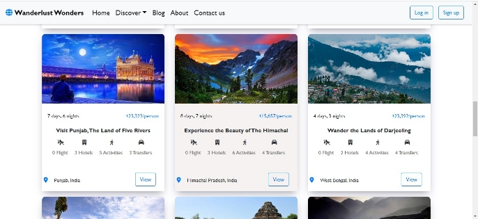

**Domestic.jsx**

import "./domestic.css";

import Menu from "../Menu/Menu.jsx";

import { Link } from "react-router-dom";

import React, { useState } from "react";

import Dom from "./categoryDom";

import Footer from "../Footer/Footer.jsx";

const Domestic = () => {

`    `const backToTop = () => {

`        `document.body.scrollTop = 0;

`        `document.documentElement.scrollTop = 0;

`    `}

`    `const [data, setItem] = useState(Dom);

`    `const filterItem = (newelem) => {

`        `const updateItem = Dom.filter((currelem) => {

`            `return currelem.category === newelem;

`        `})

`        `setItem(updateItem);

`    `}

`    `return (

`        `<>

`            `

`                `<Menu />

`                `{/\* Dropdown for location \*/}

`                `{/\* Header Image for Domestic \*/}

`                `

`                    `

`                        `

`                            `

`                        `

`                        `

`                            `

`                        `

`                        `

`                            `

`                        `

`                    `

`                    `{/\* Domestic Page Heading \*/}

`                    `

`                        `<h1>Domestic Packages</h1>

`                        `
Blessed are The Curious for They Shall have Adventures!

`                    `

`                    `

`                        `

`                            `<button class= "btn dropdown-toggle btn-transparent btn-outline-light" type="button" id="dropdownMenuButton" data-toggle="dropdown" aria-haspopup="true" aria-expanded="false">

`                                `Categories

`                            `</button>

`                            `

`                                `<option class="dropdown-item" type="button" onClick={() => setItem(Dom)}>All</option>

`                                `<option class="dropdown-item" type="button" onClick={() => filterItem('Family Pack')}>Family Pack</option>

`                                `<option class="dropdown-item" type="button" onClick={() => filterItem('Couples Pack')}>Couples Pack</option>

`                                `<option class="dropdown-item" type="button" onClick={() => filterItem('Solo Pack')}>Solo Pack</option>

`                                `<option class="dropdown-item" type="button" onClick={() => filterItem('Adventure Pack')}>Adventure Pack</option>

`                            `

`                        `

`                    `

`                `

`                `{/\* Packages Card for Domestic \*/}

`                `

`                    `

`                        `{

`                            `data.map((elem) => {

`                                `//eslint-disable-next-line

`                                `const { id, photo, duration, price, name, planeicon, planestat, hotelicon, hotelstat, personicon, personstat, caricon, carstat, category, living, going } = elem;

`                                `return (

`                                    `

`                                        `

`                                            `

`                                            `
{duration}₹{price}/person

`                                            `<h6 className="text-center m-1"><b>{name}</b></h6>

`                                            `<ul className="icons d-flex">

`                                                `<li className="includesWrapper">

`                                                    `

`                                                        `<i class={planeicon}></i>

`                                                    `

`                                                    `
{planestat}

`                                                `</li>

`                                                `<li className="includesWrapper ">

`                                                    `

`                                                        `<i class={hotelicon}></i>

`                                                    `

`                                                    `
{hotelstat}

`                                                `</li>

`                                                `<li className="includesWrapper ">

`                                                    `

`                                                        `<i class={personicon}></i>

`                                                    `

`                                                    `
{personstat}

`                                                `</li>

`                                                `<li className="includesWrapper ">

`                                                    `

`                                                        `<i class={caricon}></i>

`                                                    `

`                                                    `
{carstat}

`                                                `</li>

`                                            `</ul>

`                                            `{/\* categories for filter dropdown\*/}

`                                            `

`                                                `
{category}

`                                            `

`                                            `

`                                                `<i id="dot" className="fa-solid fa-location-dot text-primary "></i>

`                                                `
{living}

`                                                `<Link to={going}>

`                                                    `<input type="button" className="btn btn-outline-primary" value=

"View" onClick={backToTop}></input>

`                                                `</Link>

`                                            `

`                                        `

`                                    `

`                                `)

`                            `})

`                        `}

`                    `

`                `

`                `<Footer />

`            `

`        `</>

`    `)

}

export default Domestic;

**Domestic.css**

.dom h1 {

`    `position: absolute;

`    `top: 100px;

`    `left: 10px;

`    `font-weight: bolder;

`    `color: rgb(255, 255, 255);

`    `z-index: 1;

}

#dot {

`    `position: absolute;

`    `top: 410px;

`    `left: 20px;

}

.dropdown-domestic {

`    `position: absolute;

`    `left: 400px;

`    `top: 110px;

`    `z-index: 1;

}

.slider-img img {

`    `object-fit: cover;

}

.dom p:last-child {

`    `position: absolute;

`    `top: 150px;

`    `left: 12px;

`    `font-size: 15px;

`    `font-weight: 500;

`    `color: rgb(255, 255, 255);

`    `z-index: 1;

}

.card1 {

`    `height: 450px;

`    `border-radius: 0px;

`    `border: none;

`    `border-radius: 10px 10px 0px 0px;

`    `box-shadow: rgba(50, 50, 93, 0.25) 0px 13px 27px -5px, rgba(0, 0, 0, 0.3) 0px 8px 16px -8px;

}

.card1:hover {

`    `background-color: rgb(245, 242, 242);

`    `transition: 500ms;

`    `transition-timing-function: cubic-bezier(0.95, 0.05, 0.795, 0.035);

}

.card1 img {

`    `height: 200px;

`    `width: 100%;

`    `border-radius: 10px 10px 0px 0px;

`    `object-fit: cover;

}

.card1 p {

`    `font-size: 15px;

}

/\* to view the description of tour packages \*/

.card1 input {

`    `height: 10px;

`    `padding-bottom: 30px;

`    `position: absolute;

`    `bottom: 30px;

`    `right: 40px;

}

/\* location name  \*/

.card1 .location1 {

`    `position: absolute;

`    `bottom: 20px;

`    `left: 50px;

}

.card1 .icons {

`    `position: absolute;

`    `top: 290px;

`    `gap: 15px;

`    `/\* justify-content: space-between; \*/

`    `align-content: center;

`    `margin: 10px;

`    `margin-left: -10px;

}

.blackText {

`    `color: rgb(101, 100, 100);

`    `font-weight: 100;

`    `margin-top: -10px;

}

.card1 .includesWrapper {

`    `text-align: center;

}

.includesWrapper p:last-child {

`    `margin-right: 4px;

}

ul {

`    `list-style: none;

}

@media screen and (max-width: 768px) {

.dropdown-domestic {

`        `position: absolute;

`        `left: 60px;

`        `top: 200px;

`        `z-index: 1;

`    `}

.slider-img img {

`        `object-fit: cover;

`    `}

}

@media screen and (max-width: 280px) {

.dropdown-domestic {

`        `position: absolute;

`        `left: 170px;

`        `top: 250px;

`    `}

.dom p:last-child {

`        `position: absolute;

`        `top: 200px;

`        `left: 12px;

`    `}

.card1 .icons {

`        `position: absolute;

`        `top: 300px;

`        `left: -10px;

`        `gap: 0px;

`        `/\* justify-content: space-between; \*/

`        `align-content: center;

`        `margin: 10px;

`        `margin-left: -10px;

`    `}

}

**Domestic Package Description(e.g.:Kerala)**

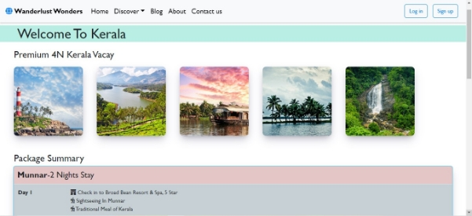

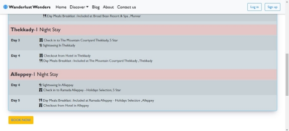

**Kerala.jsx**

import React from 'react';

import './Page.css';

import Menu from '../Menu/Menu';

import { NavLink } from 'react-router-dom';

import Footer from '../Footer/Footer';

const Kerala = () =>{

`    `const backToTop = () => {

`        `document.body.scrollTop = 0;

`        `document.documentElement.scrollTop = 0;

`    `}

`    `return(

`        `<>

`            `<Menu /> 

`            `

`                `<h1> Welcome To Kerala</h1>

`            `

`            `

`                `<h3>Premium 4N Kerala Vacay</h3>

`            `

`            `

`                `</img>

`                `</img>

`                `</img>

`                `</img>

`                `</img>

`            `

`            `  

`            `

`                `<h3>Package Summary</h3>

`            `

`            `

`                `

`                    `<h4><b>Munnar</b>-2 Nights Stay</h4>

`                `

`                `<table class="table table-striped">

`                `<tbody>

`                    `<tr>

`                        `<th scope="row">Day 1</th>

`                        `<td><i class="fa-sharp fa-solid fa-hotel"></i>  Check in to Broad Bean Resort & Spa, 5 Star <i class="fa-sharp fa-solid fa-person-hiking"></i>  Sightseeing In Munnar <i class=

"fa-sharp fa-solid fa-person-hiking"></i>  Traditional Meal of Kerala</td>

`                    `</tr>

`                    `<tr>

`                        `<th scope="row">Day 2</th>

`                        `<td><i class="fa-sharp fa-solid fa-car"></i> Private AC Sedan - AC for sightseeing in & around Munnar <i class="fa-sharp fa-solid fa-utensils"></i> Day Meals: Breakfast : Included at 

Broad Bean Resort & Spa , Munnar <i class="fa-sharp fa-solid fa-person-hiking"></i> Sightseeing

` `In Munnar</td>

`                    `</tr>

`                    `<tr>

`                        `<th scope="row">Day 3</th>

`                        `<td><i class="fa-sharp fa-solid fa-hotel"></i> Checkout from Hotel in Munnar <i class="fa-sharp fa-solid fa-utensils"></i> Day Meals: Breakfast : Included at Broad Bean Resort & Spa , Munnar</td>

`                    `</tr>

`                `</tbody>

`                `</table>

`                `

`                    `<h4><b>Thekkady</b>-1 Night Stay</h4>

`                `

`                `<table class="table table-striped">

`                `<tbody>

`                    `<tr>

`                        `<th scope="row">Day 3</th>

`                        `<td><i class="fa-sharp fa-solid fa-hotel"></i>  Check in to The Mountain Courtyard 

Thekkady, 5 Star <i class="fa-sharp fa-solid fa-person-hiking"></i> Sightseeing In Thekkady</td>

`                    `</tr>

`                    `<tr>

`                        `<th scope="row">Day 4</th>

`                        `<td><i class="fa-sharp fa-solid fa-hotel"></i> Checkout from Hotel in Thekkady <i class="fa-sharp fa-solid fa-utensils"></i> Day Meals: Breakfast : Included at The Mountain Courtyard Thekkady , Thekkady</td>

`                    `</tr>

`                `</tbody>

`                `</table>

`                `

`                    `<h4><b>Alleppey</b>-1 Night Stay</h4>

`                `

`                `<table class="table table-striped">

`                `<tbody>

`                    `<tr>

`                        `<th scope="row">Day 4</th>

`                        `<td><i class="fa-sharp fa-solid fa-person-hiking"></i> Sightseeing In Alleppey <i class="fa-sharp fa-solid fa-hotel"></i> Check in to Ramada Alleppey - Holidays Selection, 5 Star</td>

`                    `</tr>

`                    `<tr>

`                        `<th scope="row">Day 5</th>

`                        `<td><i class="fa-sharp fa-solid fa-utensils"></i> Day Meals: Breakfast : Included at Ramada Alleppey - Holidays Selection , Alleppey <i class="fa-sharp fa-solid fa-hotel"></i> Checkout from Hotel in Alleppey</td>

`                    `</tr>

`                `</tbody>

`                `</table>

`            `

`            `

`                `<button type="submit" class="btn btn-warning"><NavLink to={'/form'} onClick={backToTop} className={'nav1'} style={{ textDecoration: "none" }}>BOOK NOW</NavLink></button>

`            `

`            `<Footer />

`        `</>

`    `)

}

export default Kerala;

**International Packages Page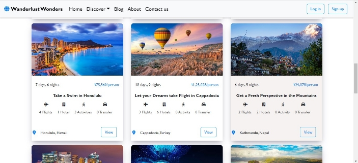**

**International.jsx**

import "./international.css";

import Menu from "../Menu/Menu.jsx";

import { Link } from "react-router-dom";

import React, { useState } from "react";

import Inter from "./categoryInt";

import Footer from "../Footer/Footer.jsx";

const International = () => {

`    `const backToTop = () => {

`        `document.body.scrollTop = 0;

`        `document.documentElement.scrollTop = 0;

`    `}

`    `const [data, setItem] = useState(Inter);

`    `const filterItem = (newelem) => {

`        `const updateItem = Inter.filter((currelem) => {

`            `return currelem.category === newelem;

`        `})

`        `setItem(updateItem);

`    `}

`    `return (

`        `<>

`            `

`                `<Menu />

`                `{/\* Header Image for International \*/}

`                `

`                    `

`                        `

`                            `

`                        `

`                        `

`                            `

`                        `

`                        `

`                            `

`                        `

`                    `

`                    `{/\* International Page Heading \*/}

`                    `

`                        `<h1>International Packages</h1>

`                        `
The world is yours to explore!

`                    `

`                    `{/\* Dropdown for category \*/}

`                    `

`                        `<button class="btn btn-transparent btn-outline-light dropdown-toggle" type="button" id="dropdownMenuButton" data-toggle="dropdown" aria-haspopup="true" aria-expanded="false">

`                            `Categories

`                        `</button>

`                        `

`                            `<button class="dropdown-item" type="button" onClick={() => setItem(Inter)}>

All</button>

`                            `<button class="dropdown-item" type="button" onClick={() => filterItem('Family Pack')}>Family Pack</button>

`                            `<button class="dropdown-item" type="button" onClick={() => filterItem('Couples Pack')}>Couples Pack</button>

`                            `<button class="dropdown-item" type="button" onClick={() => filterItem('Solo Pack')

}>Solo Pack</button>

`                            `<button class="dropdown-item" type="button" onClick={() => filterItem('Adventure Pack')}>Adventure Pack</button>

`                        `

`                    `

`                `

`                `{/\* Packages Card for International \*/}

`                `

`                    `

`                        `{

`                            `data.map((elem) => {

`                                `//eslint-disable-next-line

`                                `const { id, photo, duration, price, name, planeicon, planestat, hotelicon, hotelstat, personicon, personstat, caricon, carstat, category, living, going } = elem;

`                                `return (

`                                    `

`                                        `

`                                            `

`                                            `
{duration}₹{price}/person

`                                            `<h6 className="text-center m-1"><b>{name}</b></h6>

`                                            `<ul className="icons d-flex">

`                                                `<li className="includesWrapper">

`                                                    `

`                                                        `<i class={planeicon}></i>

`                                                    `

`                                                    `
{planestat}

`                                                `</li>

`                                                `<li className="includesWrapper ">

`                                                    `

`                                                        `<i class={hotelicon}></i>

`                                                    `

`                                                    `
{hotelstat}

`                                                `</li>

`                                                `<li className="includesWrapper ">

`                                                    `

`                                                        `<i class={personicon}></i>

`                                                    `

`                                                    `
{personstat}

`                                                `</li>

`                                                `<li className="includesWrapper ">

`                                                    `

`                                                        `<i class={caricon}></i>

`                                                    `

`                                                    `
{carstat}

`                                                `</li>

`                                            `</ul>

`                                            `{/\* categories for filter dropdown \*/}

`                                            `

`                                                `
{category}

`                                            `

`                                            `{/\* Location of the place \*/}

`                                            `

`                                                `<i id="dot" className="fa-solid fa-location-dot text-primary "></i>

`                                                `
{living}

`                                                `<Link to={going}>

`                                                    `<input type="button" className="btn btn-outline-primary" onClick={backToTop} value="View"></input>

`                                                `</Link>

`                                            `

`                                        `

`                                    `

`                                `)

`                            `})

`                        `}

`                    `

`                `

`                `<Footer />

`            `

`        `</>

`    `)

}

export default International;

**International.css**

.interna h1 {

`    `position: absolute;

`    `top: 100px;

`    `left: 10px;

`    `font-weight: bolder;

`    `color: rgb(255, 255, 255);

`    `z-index: 1;

}

#dot {

`    `position: absolute;

`    `top: 410px;

`    `left: 35px;

}

.dropdown-international {

`    `position: absolute;

`    `left: 450px;

`    `top: 110px;

`    `z-index: 1;

}

.slider-img img {

`    `object-fit: cover;

}

.interna p:last-child {

`    `position: absolute;

`    `top: 150px;

`    `left: 12px;

`    `font-size: 15px;

`    `font-weight: 500;

`    `color: rgb(255, 255, 255);

`    `z-index: 1;

}

.card1 {

`    `height: 450px;

`    `border-radius: 0px;

`    `border: none;

`    `border-radius: 10px 10px 0px 0px;

`    `box-shadow: rgba(50, 50, 93, 0.25) 0px 13px 27px -5px, rgba(0, 0, 0, 0.3) 0px 8px 16px -8px;

}

.card1:hover {

`    `background-color: rgb(245, 242, 242);

`    `transition: 500ms;

`    `transition-timing-function: cubic-bezier(0.95, 0.05, 0.795, 0.035);

}

.card1 img {

`    `height: 200px;

`    `width: 100%;

`    `border-radius: 10px 10px 0px 0px;

`    `object-fit: cover;

}

.card1 p {

`    `font-size: 15px;

}

/\* to view the description of tour packages \*/

.card1 input {

`    `height: 10px;

`    `padding-bottom: 30px;

`    `position: absolute;

`    `bottom: 30px;

`    `right: 40px;

}

/\* location name  \*/

.card1 .location1 {

`    `position: absolute;

`    `bottom: 20px;

`    `left: 50px;

}

.card1 .icons {

`    `position: absolute;

`    `top: 290px;

`    `gap: 15px;

`    `/\* justify-content: space-between; \*/

`    `align-content: center;

`    `margin: 10px;

`    `margin-left: -10px;

}

.blackText {

`    `color: rgb(101, 100, 100);

`    `font-weight: 100;

`    `margin-top: -10px;

}

.card1 .includesWrapper {

`    `text-align: center;

}

.includesWrapper p:last-child {

`    `margin-right: 4px;

}

ul {

`    `list-style: none;

}

@media screen and (max-width: 768px) {

.interna h1 {

`        `position: absolute;

`        `top: 90px;

`    `}

.dropdown-international {

`        `position: absolute;

`        `left: 60px;

`        `top: 230px;

`    `}

.interna p:last-child {

`        `top: 200px;

`    `}

.dropdown-toggle {

`        `display: fixed;

`    `}

.slider-img img {

`        `object-fit: cover;

`    `}

}

@media screen and (max-width: 280px) {

.dropdown-international {

`        `display: block;

`        `position: absolute;

`        `left: 150px;

`        `top: 250px;

`    `}

.interna p:last-child {

`        `position: absolute;

`        `top: 180px;

`        `left: 12px;

`    `}

.card1 .icons {

`        `position: absolute;

`        `top: 300px;

`        `left: -10px;

`        `gap: 0px;

`        `/\* justify-content: space-between; \*/

`        `align-content: center;

`        `margin: 10px;

`        `margin-left: -10px;

`    `}

`    `/\* .dropdown-toggle {

`        `display: fixed;

`    `} \*/

}

/\* .card1 #andaman{

`    `bottom: -3px;

} \*/

**International Package Description(e.g.:Bali)**

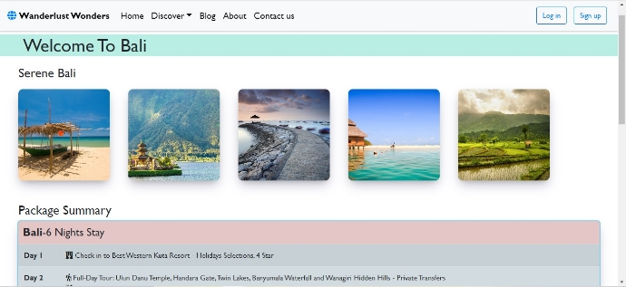

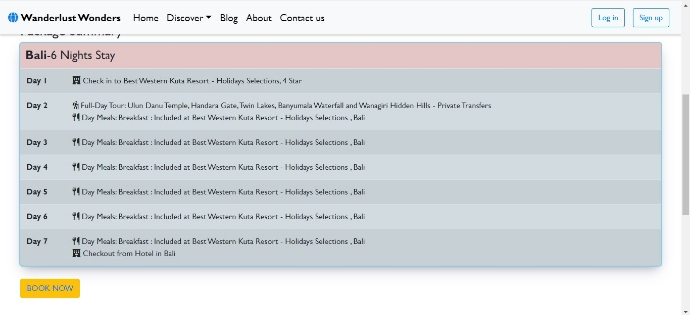

**Bali.jsx**

import React from 'react';

import '../domesticPackages/Page.css';

import Menu from '../Menu/Menu';

import { NavLink } from 'react-router-dom';

import Footer from '../Footer/Footer';

const Bali = () =>{

`    `const backToTop = () => {

`        `document.body.scrollTop = 0;

`        `document.documentElement.scrollTop = 0;

`    `}

`    `return(

`        `<>

`            `<Menu /> 

`            `

`                `<h1> Welcome To Bali</h1>

`            `

`            `

`                `<h3>Serene Bali</h3>

`            `

`            `

`                `</img>

`                `</img>

`                `</img>

`                `</img>

`                `</img>

`            `

`            `  

`            `

`                `<h3>Package Summary</h3>

`            `

`            `

`                `

`                    `<h4><b>Bali</b>-6 Nights Stay</h4>

`                `

`                `<table class="table table-striped">

`                `<tbody>

`                    `<tr>

`                        `<th scope="row">Day 1</th>

`                        `<td><i class="fa-sharp fa-solid fa-hotel"></i>  Check in to Best Western Kuta Resort - Holidays Selections, 4 Star</td>

`                    `</tr>

`                    `<tr>

`                        `<th scope="row">Day 2</th>

`                        `<td><i class="fa-sharp fa-solid fa-person-hiking"></i> Full-Day Tour: Ulun Danu Temple, Handara Gate, Twin Lakes, Banyumala Waterfall and Wanagiri Hidden Hills - Private Transfers <i class="fa-sharp fa-solid fa-utensils"></i> Day Meals: Breakfast : Included at Best Western Kuta Resort - Holidays Selections , Bali</td>

`                    `</tr>

`                    `<tr>

`                        `<th scope="row">Day 3</th>

`                        `<td><i class="fa-sharp fa-solid fa-utensils"></i> Day Meals: Breakfast : Included at Best Western Kuta Resort - Holidays Selections , Bali</td>

`                    `</tr>

`                    `<tr>

`                        `<th scope="row">Day 4</th>

`                        `<td><i class="fa-sharp fa-solid fa-utensils"></i> Day Meals: Breakfast : Included at Best Western Kuta Resort - Holidays Selections , Bali</td>

`                    `</tr>

`                    `<tr>

`                        `<th scope="row">Day 5</th>

`                        `<td><i class="fa-sharp fa-solid fa-utensils"></i>  Day Meals: Breakfast : Included at Best Western Kuta Resort - Holidays Selections , Bali</td>

`                    `</tr>

`                    `<tr>

`                        `<th scope="row">Day 6</th>

`                        `<td><i class="fa-sharp fa-solid fa-utensils"></i>  Day Meals: Breakfast : Included at Best Western Kuta Resort - Holidays Selections , Bali</td>

`                    `</tr>

`                    `<tr>

`                        `<th scope="row">Day 7</th>

`                        `<td><i class="fa-sharp fa-solid fa-utensils"></i> Day Meals: Breakfast : Included at Best Western Kuta Resort - Holidays Selections , Bali <i class="fa-sharp fa-solid fa-hotel"></i> 

` `Checkout from Hotel in Bali </td>

`                    `</tr>

`                `</tbody>

`                `</table>

`            `

`            `

`                `<button type="submit" class="btn btn-warning"><NavLink to={'/form'} onClick={backToTop} className={'nav1'} style={{ textDecoration: "none" }}>BOOK NOW</NavLink></button>

`            `

`            `<Footer />

`        `</>

`    `)

}

export default Bali;

**Blog Page**

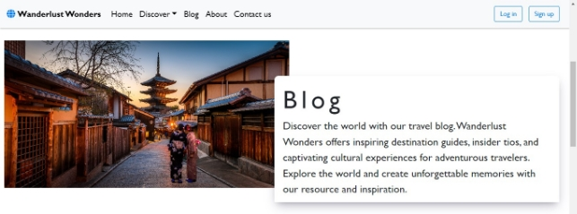

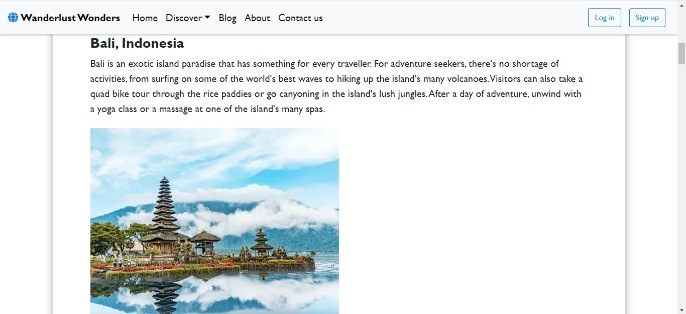

**Blogs.jsx**

import React, { useState } from "react";

import { Link } from "react-router-dom";

import Menu from "../Menu/Menu.jsx";

import Footer from "../Footer/Footer";

import Pages from "./categoryBlog";

import "./Blogs.css";

const Blogs = () => {

`    `const backToTop = () => {

`        `document.body.scrollTop = 0;

`        `document.documentElement.scrollTop = 0;

`    `}

`    `const [data] = useState(Pages);

`    `return (

`        `<>

`            `

`                `<Menu />

`                `{/\* Header Image for blogs page \*/}

`                `

`                    `

`                        `

`                            `

`                                `

`                            `

`                            `

`                                `<h1>Welcome to WanderLust Wonders Blogs</h1>

`                                `
"Embark on Unforgettable Journeys with Our Expert 

Travel Guides"

`                            `

`                        `

`                    `

`                `

`                `{/\* Picture behind the blog card text \*/}

`                `

`                    `</img>

`                    `

`                        `

`                            `<h1 class="carding-title">Blog</h1>

`                            `
Discover the world with our travel blog. Wanderlust Wonders 

offers inspiring destination guides, insider tios, and captivating cultural experiences for adventurous 

travelers. Explore the world and create unforgettable memories with our resource and inspiration.

`                        `

`                    `

`                `

`                `{/\* Cards for the blog  value taken from ./categoryBlog \*/}

`                `

`                    `

`                        `{

`                            `data.map((elem) => {

`                                `// eslint-disable-next-line

`                                `const { id, pic, written, going } = elem;

`                                `return (

`                                    `

`                                        `

`                                            `

`                                            `<h6 className="text-left m-2"><b>{written}</b></h6>

`                                            `<Link className="bloging-button" to={going}>

`                                                `<input type="button" className="btn btn-link" style={

{ textDecoration: 'none' }} value="Read more" onClick={backToTop}></input>

`                                            `</Link>

`                                        `

`                                    `

`                                `)

`                            `})

`                        `}

`                    `

`                `

`                `<Footer />

`            `

`        `</>

`    `)

}

export default Blogs;

**Blogs.css**

.blog-page h1 {

`    `position: absolute;

`    `color: white;

`    `left: 450px;

`    `top: 170px;

`    `z-index: 1;

}

.blog-page p {

`    `position: absolute;

`    `color: white;

`    `left: 550px;

`    `top: 230px;

`    `z-index: 1;

}

.content img{

`    `display: flex;

`    `margin-left: 10px;

`    `height: 350px;

`    `width: 50%;

`    `z-index: 0;

`    `object-fit: cover;

}

.card-blog{

`    `position: absolute;

`    `z-index: 1;

`    `top: 580px;

`    `left: 650px;

`    `width: 50%;

`    `height: 300px;  

}

.card-blog .carding-title{

`    `font-size: 60px;

`    `letter-spacing: 10px;

}

.card-blog .card-texting{

`    `font-size: 25px;

`    `display: flex;

`    `padding:0px 10px 10px 0px  

}

.bloging-card img {

`    `height: 200px;

`    `object-fit: cover;

}

.bloging-card .bloging-button input {

`    `right: 32.5%;

`    `left: 34%;

`    `width: 100px;

`    `bottom: 20px;

}

/\* mobile dimensions \*/

@media (max-width: 820px){

.card-blog{

`        `left: 350px;

`    `}

.card-blog .card-texting{

`        `font-size: 18px;

`    `}

}

@media (max-width:1280px){

.card-blog{

`        `left: 450px;

`    `} 

.card-blog .card-texting{

`        `font-size: 20px;

`    `}

.blog-page h1{

`        `left: 150px;

`    `}

.blog-page p{

`        `left: 255px;

`    `}

}

@media (max-width:280px) {

.card-blog:last-child{

`        `left: 140px;

`        `top: 580px;

`    `}

.card-blog:last-child .card-texting{

`        `font-size: 7px;

`    `}

}

@media (max-width:912px){

.card-blog{

`        `left: 400px;

`    `}

.card-blog .card-texting{

`        `font-size: 19px;

`    `}

.blog-page p{

`        `top: 250px;

`        `left: 250px;

`    `}

.blog-page h1{

`        `left: 150px;

`    `}

}

@media screen and (max-width: 768px) {

.blog-page h1 {

`        `left: 10px;

`    `}

.blog-page p {

`        `left: 10px;

`        `top: 330px;

`    `}

.content img{

`        `object-fit: cover;

`        `width: 180px;

`        `height: 100px;

`    `}

.card-blog .card-texting{

`        `position: absolute;

`        `top: 33px;

`        `font-size: 8px;

`    `}

.card-blog{

`        `position: absolute;

`        `top: 515px;

`        `left: 152px;

`        `width: 50%;

`        `height: 120px;

`    `}

.card-blog .carding-title{

`        `position: absolute;

`        `top: 5px;

`        `font-size:20px;

`    `}  

}

**	

**Admin Panel**

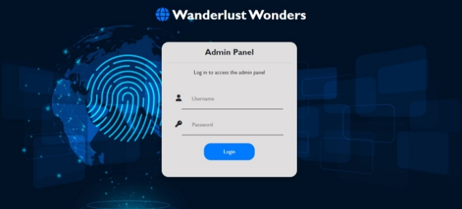

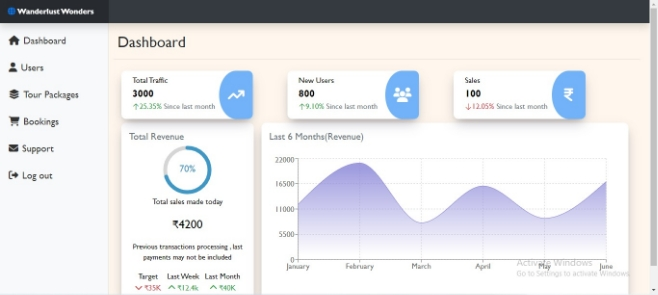

`	`**Admin.jsx**

import React from "react";

import "./Dashboard.css";

import "../Shared\_Container.css";

import { CircularProgressbar } from "react-circular-progressbar";

import "react-circular-progressbar/dist/styles.css";

import { AreaChart, Area, XAxis, YAxis, CartesianGrid, Tooltip } from 'recharts';

import Sidebar from "../Sidebar/Sidebar";

import { ToastContainer, toast } from "react-toastify";

const data = [

`    `{

`        `name: 'January',

`        `total: 12000,

`    `},

`    `{

`        `name: 'February',

`        `total: 21000,

`    `},

`    `{

`        `name: 'March',

`        `total: 8000,

`    `},

`    `{

`        `name: 'April',

`        `total: 16000,

`    `},

`    `{

`        `name: 'May',

`        `total: 9000,

`    `},

`    `{

`        `name: 'June',

`        `total: 17000,

`    `},

];

const showNotification = () => {

`    `toast.success("Login successful", {

`        `toastId: 'success1',

`    `})

}

const Dashboard = () => {

`    `return (

`        `<>

`            `{showNotification()}

`            `<ToastContainer />

`            `<Sidebar />

`            `

`                `

`                    `<h2 className="ml-2 mb-2">Dashboard</h2>

`                    `

`                    `

`                        `

`                            `

`                                `<ul className="p-2">

`                                    `<li>Total Traffic</li>

`                                    `<li><b style={{ fontSize: "20px" }}>3000</b></li>

`                                    `<li className="text-success">↑25.35% 

` `Since last month</li>

`                                `</ul>

`                                `

`                                    `<i class="fa-solid fa-arrow-trend-up" style={{ color: "white" }}></i>

`                                `

`                            `

`                            `

`                                `<ul className="p-2">

`                                    `<li>New Users</li>

`                                    `<li><b style={{ fontSize: "20px" }}>800</b></li>

`                                    `<li className="text-success">↑9.10% 

` `Since last month</li>

`                                `</ul>

`                                `

`                                    `<i class="fa-solid fa-users" style={{ color: "white" }}></i>

`                                `

`                            `

`                            `

`                                `<ul className="p-2">

`                                    `<li>Sales</li>

`                                    `<li><b style={{ fontSize: "20px" }}>100</b></li>

`                                    `<li className="text-danger">↓12.05%  

Since last month</li>

`                                `</ul>

`                                `

`                                    `<i class="fa-solid fa-indian-rupee-sign" style={{ color: "white" }}></i>

`                                `

`                            `

`                        `

`                    `

`                    `

`                        `

`                            `<h5 className="text-secondary">Total Revenue</h5>

`                            `

`                                `<CircularProgressbar className="p-bar mb-1" value={70} text={`${70}%`} />

`                                `
Total sales made today

`                                `
₹4200

`                                `
Previous transactions processing , 

last payments may not be included

`                                `

`                                    `
Target

`                                        `
<i class="fa-sharp fa-solid fa-chevron-down mr-1"></i>₹35K

`                                    `

`                                    `
Last Week

`                                        `
<i class="fa-sharp fa-solid fa-chevron-up mr-1"></i>₹12.4k

`                                    `

`                                    `
Last Month

`                                        `
<i class="fa-sharp fa-solid fa-chevron-up mr-1"></i>₹40K

`                                    `

`                                `

`                            `

`                        `

`                        `

`                            `<h5 className="mb-4 text-secondary">Last 6 Months(Revenue)</h5>

`                            `<AreaChart width={730} height={250} data={data}

`                                `margin={{ top: 10, right: 30, left: 0, bottom: 0 }}>

`                                `<defs>

`                                    `<linearGradient id="total" x1="0" y1="0" x2="0" y2="1">

`                                        `<stop offset="5%" stopColor="#8884d8" stopOpacity={0.8} />

`                                        `<stop offset="95%" stopColor="#8884d8" stopOpacity={0} />

`                                    `</linearGradient>

`                                `</defs>

`                                `<XAxis dataKey="name" />

`                                `<YAxis />

`                                `<CartesianGrid strokeDasharray="3 3" />

`                                `<Tooltip />

`                                `<Area type="monotone" dataKey="total" stroke="#8884d8" fillOpacity={1} fill="url(#total)" />

`                            `</AreaChart>

`                        `

`                    `

`                `

`            `

`        `</>

`    `);

}

export default Dashboard; 

**Admin.css**

.dash-box {

`    `background-color: rgb(255, 255, 255);

`    `height: 100px;

`    `color: rgb(0, 0, 0);

`    `box-shadow: rgba(50, 50, 93, 0.25) 0px 13px 27px -5px, rgba(0, 0, 0, 0.3) 0px 8px 16px -8px;

`    `border-radius: 10px;

}

.dash-box .dash-box-circle {

`    `background-color: #71b2f8;

`    `height: 100px;

`    `width: 70px;

`    `position: absolute;

`    `top: 0;

`    `border-radius: 50% 10px 10px 50%;

`    `right: 0;

}

.dash-box .dash-box-circle i {

`    `display: flex;

`    `justify-content: center;

`    `margin-top: 35px;

`    `font-size: 30px;

}

.middle-conatiner {

`    `height: auto;

`    `display: flex;

`    `justify-content: center;

`    `align-content: center;

}

.middle-conatiner .left-box {

`    `background-color: rgb(255, 255, 255);

`    `height: 370px;

`    `color: rgb(0, 0, 0);

`    `box-shadow: rgba(50, 50, 93, 0.25) 0px 13px 27px -5px, rgba(0, 0, 0, 0.3) 0px 8px 16px -8px;

`    `border-radius: 10px;

`    `flex: 1;

}

.left-box .desc{

`    `display: flex;

`    `justify-content: space-evenly;

}

.middle-conatiner .p-bar {

`    `height: 100px;

`    `width: 100px;

}

.middle-conatiner .right-box {

`    `background-color: rgb(255, 255, 255);

`    `height: 370px;

`    `color: rgb(0, 0, 0);

`    `box-shadow: rgba(50, 50, 93, 0.25) 0px 13px 27px -5px, rgba(0, 0, 0, 0.3) 0px 8px 16px -8px;

`    `border-radius: 10px;

`    `flex: 2;

}

**Booking Form**

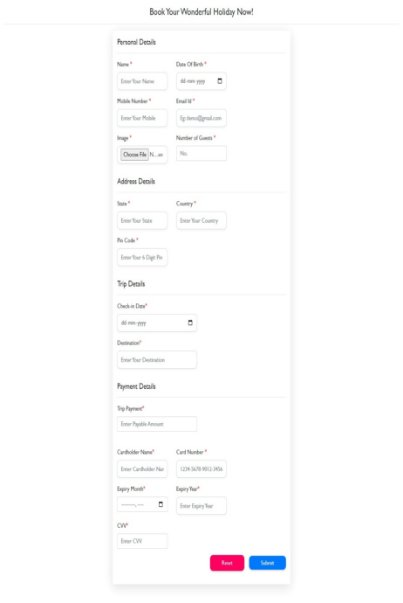

**Form.jsx**

import React, { useState } from "react";

import './Form.css';

import { NavLink, useNavigate } from "react-router-dom";

import { ToastContainer, toast } from "react-toastify";

import { bookPackage } from "../../service/api"

const Form = () => {

`    `const [user, setUser] = useState({

`        `name: '',

`        `dob: '',

`        `mobile: '',

`        `email: '',

`        `image: '',

`        `guests: "",

`        `state: '',

`        `country: '',

`        `pin: '',

`        `checkInDate: "",

`        `amount: "",

`        `cardHolderName: "",

`        `cardNumber: "",

`        `expiryMonth: "",

`        `expiryYear: "",

`        `cvv: "",

`        `destination: "",

`    `})

`    `const fileData = (e) => {

`        `setUser({ ...user, image: e.target.files[0] });

`    `}

`    `const onValueChange = (e) => {

`        `setUser({ ...user, [e.target.name]: e.target.value });

`        `console.log(user);

`    `}

`    `const navigate = useNavigate();

`    `const submitForm = async (e) => {

`        `e.preventDefault();

`        `const { name, dob, mobile, email, guests, state, country, pin, checkInDate, amount, cardHolderName, cardNumber, expiryMonth, expiryYear, cvv, destination } = user;

`        `if (!name) {

`            `toast.warn("Enter your name!");

`        `} else if (!dob) {

`            `toast.warn("Enter Date Of Birth!");

`        `} else if (!mobile) {

`            `toast.warn("Enter Your Mobile!");

`        `} else if (!email) {

`            `toast.warn("Enter Your Email!");

`        `} else if (!guests) {

`            `toast.warn("Enter The no. of guests!");

`        `} else if (!state) {

`            `toast.warn("Enter Your State!");

`        `} else if (!country) {

`            `toast.warn("Enter Your Country!");

`        `} else if (!pin) {

`            `toast.warn("Enter Your Pin Code!");

`        `} else if (!checkInDate) {

`            `toast.warn("Enter check-in date!");

`        `} else if (!amount) {

`            `toast.warn("Enter the payable amount!");

`        `} else if (!cardHolderName) {

`            `toast.warn("Enter the card-holder name!");

`        `} else if (!cardNumber) {

`            `toast.warn("Enter card number!");

`        `} else if (!expiryMonth) {

`            `toast.warn("Enter the expiry month!");

`        `} else if (!expiryYear) {

`            `toast.warn("Enter the expiry year!");

`        `} else if (!cvv) {

`            `toast.warn("Enter the cvv!");

`        `} else if (!destination) {

`            `toast.warn("Enter Destination!")

`        `}

`        `else {

`            `const formData = new FormData();

`            `formData.append('image', user.image, user.image.name);

`            `formData.append('name', user.name);

`            `formData.append('dob', user.dob);

`            `formData.append('mobile', user.mobile);

`            `formData.append('email', user.email);

`            `formData.append('guests', user.guests);

`            `formData.append('state', user.state);

`            `formData.append('country', user.country);

`            `formData.append('pin', user.pin);

`            `formData.append('checkInDate', user.checkInDate);

`            `formData.append('amount', user.amount);

`            `formData.append("cardHolderName", user.cardHolderName);

`            `formData.append("cardNumber", user.cardNumber);

`            `formData.append("expiryMonth", user.expiryMonth);

`            `formData.append("expiryYear", user.expiryYear);

`            `formData.append("cvv", user.cvv);

`            `formData.append("destination", user.destination);

`            `const res = await bookPackage(formData);

`            `if (res.status === 201) {

`                `toast.success("Thanks for booking and choosing us!", {

`                    `position: "top-center",

`                `});

`                `setTimeout(() => {

`                    `navigate("/");

`                `}, 6000);

`            `}

`            `else {

`                `toast.error("Something went wrong try again later!", {

`                    `position: "top-center",

`                `});

`            `}

`        `}

`    `}

`    `return (

`        `<>

`            `

`                `<ToastContainer />

`                `<form>

`                    `<h4 className="text-center pt-3">Book Your Wonderful Holiday Now!</h4>

`                    `

`                        `<h5 className="pt-3">Personal Details</h5>

`                        `

`                            `

`                                `

`                                    `<label htmlFor="name">Name \*</label>

`                                    `<input type="text" name="name" onChange={onValueChange} class="form-control" id="name" aria-describedby="emailHelp" placeholder="Enter Your Name" />

`                                `

`                            `

`                            `

`                                `

`                                    `<label htmlFor="dob">Date Of Birth \*</label>

`                                    `<input type="date" name="dob" onChange={onValueChange} class="form-control" id="dob" aria-describedby="emailHelp" placeholder="Enter Your Name" />

`                                `

`                            `

`                        `

`                        `

`                            `

`                                `

`                                    `<label htmlFor="mobile">Mobile Number \*</label>

`                                    `<input type="text" name="mobile" onChange={onValueChange} class="form-control" id="mobile" aria-describedby="emailHelp" placeholder="Enter Your Mobile" />

`                                `

`                            `

`                            `

`                                `

`                                    `<label htmlFor="email">Email Id \*</label>

`                                    `<input type="email" name="email" onChange={onValueChange}

` `class="form-control" id="email" aria-describedby="emailHelp" placeholder="Eg: 

demo@gmail.com" />

`                                `

`                            `

`                        `

`                        `

`                            `

`                                `

`                                    `<label htmlFor="image">Image \*</label>

`                                    `<input type="file" name="image" onChange={fileData} class="form-control" id="image" aria-describedby="emailHelp" placeholder="Eg: demo@gmail.com" />

`                                `

`                            `

`                            `

`                                `

`                                    `<label htmlFor="guests">Number of Guests \*</label>

`                                    `<input type="number" name="guests" onChange={onValueChange} class="form-control" id="guests" aria-describedby="emailHelp" min={1} placeholder="No." />

`                                `

`                            `

`                        `

`                        `

`                            `<h5 className="pt-3">Address Details</h5>

`                        `

`                        `

`                            `

`                                `

`                                    `<label htmlFor="state">State \*</label>

`                                    `<input type="text" name="state" onChange={onValueChange} class=

"form-control" id="state" aria-describedby="emailHelp" placeholder="Enter Your State" />

`                                `

`                            `

`                            `

`                                `

`                                    `<label htmlFor="country">Country \*

</label>

`                                    `<input type="text" name="country" onChange={onValueChange} class=

"form-control" id="country" aria-describedby="emailHelp" placeholder="Enter Your Country" />

`                                `

`                            `

`                        `

`                        `

`                            `

`                                `

`                                    `<label htmlFor="pin">Pin Code \*</label>

`                                    `<input type="text" name="pin" onChange={onValueChange} class=

"form-control" id="pin" aria-describedby="emailHelp" placeholder="Enter Your 6 Digit Pin" />

`                                `

`                            `

`                        `

`                        `

`                            `<h5 className="pt-3">Trip Details</h5>

`                        `

`                        `

`                            `

`                                `

`                                    `<label htmlFor="checkInDate">Check-in Date\*

</label>

`                                    `<input type="date" name="checkInDate" onChange={onValueChange} class=

"form-control" id="checkInDate" aria-describedby="emailHelp" />

`                                `

`                                `

`                                    `<label htmlFor="destination">Destination\*</label>

`                                    `<input type="text" name="destination" onChange={onValueChange} class="form-control" id="destination" aria-describedby="emailHelp" placeholder="Enter Your Destination" />

`                                `

`                            `

`                        `

`                        `

`                            `<h5 className="pt-3">Payment Details</h5>

`                        `

`                        `

`                            `

`                                `

`                                    `<label htmlFor="amount">Trip Payment\*</label>

`                                    `<input type="number" name="amount" onChange={onValueChange} class="form-control"  id="amount " aria-describedby="emailHelp" placeholder="Enter Payable Amount" /> 

`                                `

`                            `

`                        `

`                        `

`                            `

`                                `

`                                    `<label htmlFor="cardHolderName"> Cardholder Name\*</label>

`                                    `<input type="text" name="cardHolderName" onChange={onValueChange} class="form-control" id="cardHolderName" aria-describedby="emailHelp" placeholder="Enter 

Cardholder Name" />

`                                `

`                            `

`                            `

`                                `

`                                    `<label htmlFor="cardNumber"> Card Number \*</label>

`                                    `<input type="text" name="cardNumber" onChange={onValueChange} class="form-control" id="cardNumber" aria-describedby="emailHelp" placeholder="1234-5678-

9012-3456" />

`                                `

`                            `

`                        `

`                        `

`                            `

`                                `

`                                    `<label htmlFor="expiryMonth"> Expiry Month\*</label>

`                                    `<input type="month" name="expiryMonth" onChange={onValueChange}

` `class="form-control" id="expiryMonth" aria-describedby="emailHelp" placeholder="Enter Expiry

` `Month" />

`                                `

`                            `

`                            `

`                                `

`                                    `<label htmlFor="expiryYear"> Expiry Year\*</label>

`                                    `<input type="text" name="expiryYear" onChange={onValueChange} class="form-control" id="expiryYear" aria-describedby="emailHelp" placeholder="Enter Expiry Year" />

`                                `

`                            `

`                        `

`                        `

`                            `

`                                `

`                                    `<label htmlFor="cvv"> CVV\*</label>

`                                    `<input type="password" name="cvv" onChange={onValueChange} class="form-control" id="cvv" aria-describedby="emailHelp" placeholder="Enter CVV" />

`                                `

`                            `

`                        `

`                        `

`                            `

`                                `

`                                    `<input type="reset" value={'Reset'} className="mr-3"></input>

`                                    `<NavLink to={''} className={'btn-submit'} onClick={submitForm}>Submit</NavLink>

`                                `

`                            `

`                        `

`                    `

`                `</form>

`            `

`        `</>

`    `)

}

export default Form;

`	`**Form.css**

.form\_book{

`    `height: auto;

`    `width: 45%;

`    `padding-bottom: 10px;

`    `background-color: #fff;

`    `border-radius: 5px;

`    `box-shadow: rgba(100, 100, 111, 0.2) 0px 7px 29px 0px;

}

.form-filed .form-group input[type="text"], input[type="date"], input[type="email"], input[type="file"]{

`    `height: 45px;

`    `font-size: auto;

`    `border-radius: 10px;

`    `box-shadow: rgba(0, 0, 0, 0.04) 0px 3px 5px;

}

.form-filed .form-group select{

`    `height: 45px;

`    `border-radius: 10px;

`    `box-shadow: rgba(0, 0, 0, 0.04) 0px 3px 5px;

}

.submit-btn {

`    `display: block;

`    `float: left;

}

.submit-btn .btn-submit{

`    `background-color: #0079FF;

`    `color: #fff;

`    `text-decoration: none;

`    `border: none;

`    `padding: 8px 40px;

`    `border-radius: 10px;

`    `box-shadow: rgba(0, 0, 0, 0.15) 0px 3px 3px 0px;

}

.submit-btn input[type="reset"]{

`    `background-color: #FF0060;

`    `color: #fff;

`    `margin-bottom: 10px;

`    `text-decoration: none;

`    `border: none;

`    `padding: 8px 40px;

`    `border-radius: 10px;

`    `box-shadow: rgba(0, 0, 0, 0.15) 0px 3px 3px 0px;

}

#name{

`    `font-size: 13px;

`    `letter-spacing: 2px;

`    `font-weight: 500;

`    `display: none;

}

@media screen and (max-width:768px){

.form\_book{

`        `width:100%

`    `}

}

@media (width:820px){

.form\_book{

`        `width: 100%;

`    `}

}

@media (width:912px){

.form\_book{

`        `width: 100%;

`    `}

}

@media (width:1024px){

.form\_book{

`        `width: 100%;

`    `}

}

@media (width:1280px){

.form\_book{

`        `width: 70%;

`    `}

`	                     `IMPLEMENTATION AND TESTING

`	`A software system test plan is a document that describes the objectives, scope, approach and focus of software testing effort. The process of preparing a test plan is a usual way to think the efforts needed to validate the acceptability of a software product. The complete document will help people outside the test group understand the "WHY" and "HOW" product validation. It should be through enough to be useful but not so through that no one outside the test group will read it.

### **INTRODUCTION**
Testing is the process of running a system with the intention of finding errors. Testing enhances the integrity of a system by detecting deviations in design and errors in the system. Testing aims at detecting error-prone areas. This helps in the prevention of errors in a system. Testing also adds value to the product by conforming to the user requirements. The main purpose of testing is to detect errors and error-prone areas in a system. Testing must be thorough and well-planned. A partially tested system is as bad as an untested system. And the price of an untested and under-tested system is high. The implementation is the final and important phase. It involves user training, system testing in order to ensure successful running of the proposed system. The user tests the system and changes are made according to their needs. The testing involves the testing of the developed system using various kinds of

data. While testing, errors are noted and correctness is the mode.

### **OBJECTIVES OF TESTING:**

The objective our test plan is to find and report as many bugs as possible to improve the integrity of our program. Although exhaustive testing is not possible, we will exercise a broad range of tests to achieve our goal. Our user interface to utilize these functions is designed to be user-friendly and provide easy manipulation of the tree. The application will only be used as a demonstration tool, but we would like to ensure that it could be run from a variety of platforms with little impact on performance or usability.

###### **Process Overview**
The following represents the overall flow of the testing process:

1. Identify the requirements to be tested. All test cases shall be derived using the current Program Specification.
1. Identify which particular test(s) will be used to test each module.

1. Review the test data and test cases to ensure that the unit has been thoroughly verified and that the test data and test cases are

adequate to verify proper operation of the unit.

1. Identify the expected results for each test.

1. Document the test case configuration, test data, and expected results.

1. Perform the test(s).

### **TEST CASES**

A test case is a document that describe an input, action, or event and expected response, to determine if a feature of an application is working correctly. A test case should contain particular such as test case identifier, test condition, input data

Requirement expected results. The process of developing test cases can help find problems in the requirement or design of an application, since it requires completely thinking through the operation of the application.

####### **TESTING STEPS**

**Unit Testing:**

Unit testing focuses efforts on the smallest unit of software design. This is known as module testing. The modules are tested separately. The test is carried out during programming stage itself. In this step, each module is found to be working satisfactory as regards to the expected output from the module.
####### **Integration Testing:**

Data can be lost across an interface. One module can have an adverse effect on another, sub functions, when combined, may not be linked in desired manner in major functions. Integration testing is a systematic approach for constructing the program structure, while at the same time conducting test to uncover errors associated within the interface. The objective is to take unit tested modules and builds program structure. All the modules are combined and tested as a whole.

####### **Validation:**

At the culmination of the integration testing, Software is completely assembled as a package. Interfacing errors have been uncovered and corrected and a final series of software test begin in validation testing. Validation testing can be defined in many ways, but a simple definition is

that the validation succeeds when the software functions in a manner that is expected by the customer. After validation test has been conducted, one of the three possible conditions exists.

1) The function or performance characteristics confirm to specification and are accepted.

1) A deviation from specification is uncovered and a deficiency lists is created.
1) Proposed system under consideration has been tested by using validation test and found to be working satisfactory.

|**Tested By:**|Dipto Das & Swapnil Bhattacharya|||
| :- | :- | :- | :- |
|**Test Type**|System Testing|||
|**Test Case Number**|1|||
|**Test Case Name**|Login, admin panel and working of the project.|||
|**Test Case Description**|The customer must be able to login or signup easily.If there rises any kind of doubts the customer can contact the admin through the Contact us page and the admin can check the various update through the admin panel.|||
|**Item(s) to be tested**||||
|1|Project is various units and then as a system as a whole.|||
|**Specifications**||||
|**Input**|**Expected Output/Result**|||
|1) Correct Input|1) Successful Result|||

|**Tested By:**|Meenakshi Sarkar|||
| :- | :- | :- | :- |
|**Test Type**|Unit Testing and Integration Testing|||
|**Test Case Number**|2|||
|**Test Case Name**|Package availability,booking and making payment.|||
|**Test Case Description**|The customer who wants to book a holiday package can easily book a package and make payment.|||
|**Item(s) to be tested**||||
|1|To check the database if the package is available at that moment. |||
|**Specifications**||||
|

**Input**
|
**Expected**

**Output/Result**
|||
|
1) Search package name by using their key value. If available then book.

2) If not Available
|
1) Successfully booked your holiday.

2) Change dates if possible or try again later.
|||

# **WHITE BOX TESTING**
In white box testing, the UI is bypassed. Inputs and outputs are tested directly at the code level and the results are compared against specifications. This form of testing ignores the function of the program under test and will focus only on its code and the structure of that code. Test case designers shall generate cases that not only cause each condition to take on all possible values at least once, but that cause each such condition to be executed at least once. To ensure this happens, we will be applying Branch Testing. Because the functionality of the program is relatively simple, this method will be feasible to apply.

Each function of the binary tree repository is executed independently; therefore, a program flow for each function has been derived from the code.
# **BLACK BOX TESTING**
Black box testing typically involves running through every possible input to verify that it results in the right outputs using the software as an end-user would. We have decided to perform Equivalence Partitioning and Boundary Value Analysis testing on our application.

System Testing

The goals of system testing are to detect faults that can only be exposed by testing the entire integrated system or some major part of it. Generally, system testing is mainly concerned with areas such as performance, security, validation, load/stress, and

configuration sensitivity. But in our case well focus only on function validation and performance. And in both cases we will use the black-box method of testing.

#### OUTPUT TESTING

After performing the validation testing, the next step is output testing of the proposed system, since no system could be useful if it does not produce the required output in a specific format. The output format on the screen is found to be correct. The format was designed in the system design time according to the user needs. For the hard copy also; the output comes as per the specified requirements by the user. Hence output testing did not result in any correction for the system.

####### **User Acceptance Testing:**

User acceptance of a system is the key factor for the success of any system. The system under consideration is tested for the user acceptance by constantly keeping in touch with the prospective system users at the time of developing and making changes whenever required.

This is done in regard to the following point: a) Input Screen Design

2) Output Screen Design
2) Format of reports and other outputs.

**GOAL OF TESTING**

"Program testing can be used to slow the presence of bug, but never to slow their absence." If the results delivered by the system are different from the excepted ones then the system is incorrect and these bugs should be fixed.

#### INTEGRATION TEST REPORTS

Software testing is always used in association with verification and validation. In the testing phase of this project our aim is to find the answer to following two questions.

0. Whether the software matches with the specification (i.e. process base) to verify the product.

0. Whether this software in one client what wants (i.e. product base) to validate the product.

Unit testing and integration testing has been carried out to find the answer to above questions. In unit testing each individual module was test to find any unexpected behaviour if exists. Later all the module was integrated and flat file was generated.

####### **FUNCTIONAL TESTING**

These are the points concerned during the stress test:

0. Nominal input: character is in putted in the place of digits and the system has to flash the message "Data error"
0. Boundary value analysis: exhaustive test cases have designed to create an output report that produces the maximum (and minimum) allowable number of table entries.

**Testing Method Used**

We have adopted a testing method which is a mix of both (structural) and black box (functional) testing. For modules we have adopted white box testing. Then we integrated the module into sub - systems and further into the system. These we adopted black box testing for checking the correctness of the system.

Requirements Validated and Verified:

- The data is getting entered properly into database.
- The Screens are being loaded correctly
- The	Various	functions	specified	are being performed completely.

SYSTEM SECURITY

s

1. # **DATABASE SECURITY**

System security measure is meant to be provided to make your system reliable and secured from unauthorized user may create threats to the system. So you should follow some security measures. We have used security levels in database level at system level.

1. # **SYSTEM SECURITY**

If we talk about the system security in our proposed system we have implemented with the help of maintain the session throughout the system’s use. Once a user has logged out than he/she will not be able to perform any task before signing back again.

A high level of authentic login is given to the system so this is a very tedious task to enter without authorization and authentication.

# **7c. LIMITATIONS:**

- Since it is an online project, customers need internet connection to use it.
- People who are not familiar with computers can’t use this software.
- Customer must have debit card or credit card to purchase a product.

8. # **CONCLUSION**

This project has been appreciated by all the users in the organization. It is easy to use, since it uses the GUI provided in the user dialog. User friendly screens are provided. The usage of software increases the efficiency, decreases the effort. It has been efficiently employed as a Site management mechanism. It has been thoroughly tested and implemented.

#
#
# `	`**9.FUTURE SCOPE AND**
**FURTHER**
# **ENHANCEMENTS**
In future we would like to keep working on this project and make new additions to provide users with more advanced features and more detailed information. We have set our sights on the following additions in future:-

1. Forget Password for admin and user
1. Customer Experience
1. Mobile Friendliness
1. The	transformation	from	image recognition to product recognition.
1. A high degree of individualization in all aspects.
1. Online payment process through debit and credit cards.
1. Auto-mail will be sent to the user email-id when they are purchased some products.

# **10.BIBLIOGRAPHY**

0. <https://www.w3schools.com/>
0. <https://www.youtube.com/>
0. <https://www.npmjs.com/>
0. <https://nodejs.org/en>
0. <https://reactjs.org/>
0. <https://mongodb.org./>

